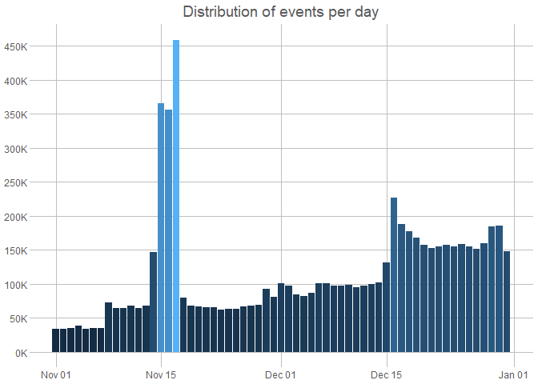
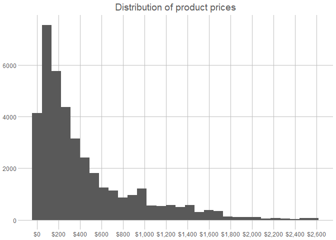

# Online Odyssey Outlet - Data Modelling Script
Lebintiti Kobe

- [Load Data](#load-data)
  - [Clean up character data](#clean-up-character-data)
  - [Convert date column into their correct
    format](#convert-date-column-into-their-correct-format)
  - [Validate the data](#validate-the-data)
  - [Products](#products)
  - [Dates](#dates)
  - [Price](#price)

# Load Data

<details class="code-fold">
<summary>Code</summary>

``` r
options(scipen = 999)
require(tidyverse)
require(here)
require(skimr)
require(pander)
require(ggthemes)

nov_data <- read_csv(here("data/november.csv.gz"))
dec_data <- read_csv(here("data/december.csv.gz"))

nov_data %>%
    head() %>%
    knitr::kable()
```

</details>

| event_time | event_type | product_id | category_id | category_code | brand | price | user_id | user_session |
|:---|:---|---:|---:|:---|:---|---:|---:|:---|
| 2019-11-01 00:00:14 UTC | cart | 1005014 | 2053013555631882496 | electronics.smartphone | samsung | 503.09 | 533326659 | 6b928be2-2bce-4640-8296-0efdf2fda22a |
| 2019-11-01 00:00:41 UTC | purchase | 13200605 | 2053013557192163840 | furniture.bedroom.bed | NA | 566.30 | 559368633 | d6034fa2-41fb-4ac0-9051-55ea9fc9147a |
| 2019-11-01 00:01:04 UTC | purchase | 1005161 | 2053013555631882496 | electronics.smartphone | xiaomi | 211.92 | 513351129 | e6b7ce9b-1938-4e20-976c-8b4163aea11d |
| 2019-11-01 00:03:24 UTC | cart | 1801881 | 2053013554415534336 | electronics.video.tv | samsung | 488.80 | 557746614 | 4d76d6d3-fff5-4880-8327-e9e57b618e0e |
| 2019-11-01 00:03:39 UTC | cart | 1005115 | 2053013555631882496 | electronics.smartphone | apple | 949.47 | 565865924 | fd4bd6d4-bd14-4fdc-9aff-bd41a594f82e |
| 2019-11-01 00:04:51 UTC | purchase | 1004856 | 2053013555631882496 | electronics.smartphone | samsung | 128.42 | 562958505 | 0f039697-fedc-40fa-8830-39c1a024351d |

<details class="code-fold">
<summary>Code</summary>

``` r
dec_data %>%
    head() %>%
    knitr::kable()
```

</details>

| event_time | event_type | product_id | category_id | category_code | brand | price | user_id | user_session |
|:---|:---|---:|---:|:---|:---|---:|---:|:---|
| 2019-12-01 00:00:02 UTC | purchase | 26400248 | 2053013553056579840 | computers.peripherals.printer | NA | 132.31 | 535135317 | 61792a26-672f-4e61-9832-7b63bb1714db |
| 2019-12-01 00:00:12 UTC | cart | 1004833 | 2232732093077520640 | construction.tools.light | samsung | 167.03 | 557794415 | 6fecf566-ebb0-4e70-a243-cdc13ce044cb |
| 2019-12-01 00:00:28 UTC | cart | 17800342 | 2053013559868129792 | computers.desktop | zeta | 66.90 | 550465671 | 22650a62-2d9c-4151-9f41-2674ec6d32d5 |
| 2019-12-01 00:00:30 UTC | cart | 1005003 | 2232732093077520640 | construction.tools.light | huawei | 227.64 | 555295228 | 3de3ac21-f446-4cf5-b3c3-06a051c5caa9 |
| 2019-12-01 00:00:39 UTC | cart | 3701309 | 2053013565983425536 | appliances.environment.vacuum | polaris | 89.32 | 543733099 | a65116f4-ac53-4a41-ad68-6606788e674c |
| 2019-12-01 00:00:39 UTC | purchase | 1004739 | 2232732093077520640 | construction.tools.light | xiaomi | 167.29 | 569958205 | 80afff78-be88-479a-8930-83b3e6220926 |

Merge november and december data since the have the same data schema
then view the data

<details class="code-fold">
<summary>Code</summary>

``` r
events_data <- bind_rows(nov_data, dec_data)
events_data %>%
    head() %>%
    knitr::kable()
```

</details>

| event_time | event_type | product_id | category_id | category_code | brand | price | user_id | user_session |
|:---|:---|---:|---:|:---|:---|---:|---:|:---|
| 2019-11-01 00:00:14 UTC | cart | 1005014 | 2053013555631882496 | electronics.smartphone | samsung | 503.09 | 533326659 | 6b928be2-2bce-4640-8296-0efdf2fda22a |
| 2019-11-01 00:00:41 UTC | purchase | 13200605 | 2053013557192163840 | furniture.bedroom.bed | NA | 566.30 | 559368633 | d6034fa2-41fb-4ac0-9051-55ea9fc9147a |
| 2019-11-01 00:01:04 UTC | purchase | 1005161 | 2053013555631882496 | electronics.smartphone | xiaomi | 211.92 | 513351129 | e6b7ce9b-1938-4e20-976c-8b4163aea11d |
| 2019-11-01 00:03:24 UTC | cart | 1801881 | 2053013554415534336 | electronics.video.tv | samsung | 488.80 | 557746614 | 4d76d6d3-fff5-4880-8327-e9e57b618e0e |
| 2019-11-01 00:03:39 UTC | cart | 1005115 | 2053013555631882496 | electronics.smartphone | apple | 949.47 | 565865924 | fd4bd6d4-bd14-4fdc-9aff-bd41a594f82e |
| 2019-11-01 00:04:51 UTC | purchase | 1004856 | 2053013555631882496 | electronics.smartphone | samsung | 128.42 | 562958505 | 0f039697-fedc-40fa-8830-39c1a024351d |

## Clean up character data

- Convert them to the same casing
- Remove whitespaces

<details class="code-fold">
<summary>Code</summary>

``` r
events_data <- events_data %>%
    mutate(across(where(is.character), ~ trimws(.) %>% str_to_lower()))
```

</details>

## Convert date column into their correct format

- Convert date in character format to date format

<details class="code-fold">
<summary>Code</summary>

``` r
events_data <- events_data %>%
    mutate(across(contains("time"), ~ as_datetime(.))) %>%
    janitor::clean_names()
```

</details>

Inspect and skim the data

<details class="code-fold">
<summary>Code</summary>

``` r
events_data %>% skim()
```

</details>

|                                                  |            |
|:-------------------------------------------------|:-----------|
| Name                                             | Piped data |
| Number of rows                                   | 7033125    |
| Number of columns                                | 9          |
| \_\_\_\_\_\_\_\_\_\_\_\_\_\_\_\_\_\_\_\_\_\_\_   |            |
| Column type frequency:                           |            |
| character                                        | 4          |
| numeric                                          | 4          |
| POSIXct                                          | 1          |
| \_\_\_\_\_\_\_\_\_\_\_\_\_\_\_\_\_\_\_\_\_\_\_\_ |            |
| Group variables                                  | None       |

Data summary

**Variable type: character**

| skim_variable | n_missing | complete_rate | min | max | empty | n_unique | whitespace |
|:--------------|----------:|--------------:|----:|----:|------:|---------:|-----------:|
| event_type    |         0 |          1.00 |   4 |   8 |     0 |        2 |          0 |
| category_code |         0 |          1.00 |   9 |  38 |     0 |      134 |          0 |
| brand         |    395108 |          0.94 |   2 |  30 |     0 |     3343 |          0 |
| user_session  |        27 |          1.00 |  36 |  36 |     0 |  3169946 |          0 |

**Variable type: numeric**

| skim_variable | n_missing | complete_rate | mean | sd | p0 | p25 | p50 | p75 | p100 | hist |
|:---|---:|---:|---:|---:|---:|---:|---:|---:|---:|:---|
| product_id | 0 | 1 | 8178773.45 | 18286221.72 | 1000894 | 1004873.00 | 1307188.00 | 5100610.00 | 100064202\.00 | ▇▁▁▁▁ |
| category_id | 0 | 1 | 2140740273282829824.00 | 89416593483221328.00 | 2053013551865397504 | 2053013555631882496.00 | 2053013566100866048.00 | 2232732093077520640.00 | 2232732138325672448.00 | ▇▁▁▁▇ |
| price | 0 | 1 | 318.68 | 343.81 | 0 | 104.25 | 189.18 | 385.83 | 2574.07 | ▇▂▁▁▁ |
| user_id | 0 | 1 | 546854478\.25 | 26297688.53 | 39480587 | 519151225\.00 | 546882778\.00 | 570244502\.00 | 595414329\.00 | ▁▁▁▁▇ |

**Variable type: POSIXct**

| skim_variable | n_missing | complete_rate | min | max | median | n_unique |
|:---|---:|---:|:---|:---|:---|---:|
| event_time | 0 | 1 | 2019-11-01 00:00:14 | 2019-12-31 23:59:09 | 2019-12-07 16:10:17 | 3033668 |

## Validate the data

Validate the data to make sure it do not violate business logic :

### Online Stores Business logic :

User Columns :

- 

Date Columns :

- Data should be available on all business days dates .
- Times of order should always be before delivery times / return times ,
  and so on .

Price Columns :

- Prices can be less than zero .
- Investigate prices that are too high or too low .

Products/Brands/Categories :

- Each product ID should be unique to each product .
- Each product ID should have one brand/category and so forth .

Event types :

- Usually we should have more product impressions than cart actions ,
  more cart actions than checkouts and so forth .

Of course , there is so much we can validate for online store data , but
for now we focus on the data we have , nothing more nothing less .

## Products

## Dates

<details class="code-fold">
<summary>Code</summary>

``` r
event_data <- events_data %>%
    mutate(event_date = as_date(event_time))
```

</details>

### Verify if day has a record

<details class="code-fold">
<summary>Code</summary>

``` r
event_data %>%
    group_by(event_date) %>%
    count() %>%
    filter(n < 1)
```

</details>

    # A tibble: 0 × 2
    # Groups:   event_date [0]
    # ℹ 2 variables: event_date <date>, n <int>

### Check the number of events distribution

<details class="code-fold">
<summary>Code</summary>

``` r
event_data %>%
    group_by(event_date) %>%
    summarise(n = n()) %>%
    ggplot(aes(x = event_date, y = n, fill = n)) +
    geom_col(show.legend = F) +
    labs(title = "Distribution of events per day", x = "Event Date", y = "") +
    scale_y_continuous(n.breaks = 10, labels = scales::label_number(scale = 0.001, suffix = "K")) +
    theme_excel_new()
```

</details>



- Events are the lowest at the start of november , maybe be the time
  when the start-up launched .
- Events are the highest mid-november , maybe an event was held around
  this time .
- Then after we see a steady rise in events overtime , maybe correspond
  to normal business growth .

Enquire about these to figure out what was happening around these times
. Remember we need to adjust for any artificial boosting of events/sales
because these can bias products that were advertised as part of boosting
campaigns

## Price

### Distribution of prices

<details class="code-fold">
<summary>Code</summary>

``` r
event_data %>%
    select(product_id, price) %>%
    distinct() %>%
    ungroup() %>%
    select(price) %>%
    unique() %>%
    ggplot(aes(x = price)) +
    geom_histogram() +
    labs(title = "Distribution of product prices", y = "Number of products", x = "Price") +
    scale_x_continuous(n.breaks = 15, labels = scales::label_currency()) +
    theme_excel_new()
```

</details>



- We have a price range of \$0 - \$2600 and most products are prices
  below \$600 .

### Investigate low and high priced products

<details class="code-fold">
<summary>Code</summary>

``` r
event_data %>%
    select(-contains("event"), -contains("user")) %>%
    distinct(product_id, .keep_all = T) %>%
    filter(price < 50)
```

</details>

    # A tibble: 33,337 × 5
       product_id category_id category_code                  brand    price
            <dbl>       <dbl> <chr>                          <chr>    <dbl>
     1    1600282     2.05e18 computers.peripherals.printer  hp       38.4 
     2    4804295     2.05e18 electronics.audio.headphone    xiaomi   22.8 
     3    4802233     2.05e18 electronics.audio.headphone    jbl      43.7 
     4    3100034     2.05e18 appliances.kitchen.blender     braun    48.9 
     5    4500770     2.05e18 appliances.kitchen.hob         greta    29.2 
     6    2500859     2.05e18 appliances.kitchen.oven        asel     43.7 
     7    4802159     2.05e18 electronics.audio.headphone    jbl       8.49
     8   52900057     2.14e18 accessories.bag                stayer   25.6 
     9   13902420     2.05e18 construction.components.faucet decoroom 38.3 
    10    5800822     2.05e18 electronics.audio.subwoofer    kenwood  34.8 
    # ℹ 33,327 more rows

<details class="code-fold">
<summary>Code</summary>

``` r
event_data %>%
    select(-contains("event"), -contains("user")) %>%
    distinct() %>%
    filter(price < 2000)
```

</details>

    # A tibble: 185,987 × 5
       product_id category_id category_code               brand     price
            <dbl>       <dbl> <chr>                       <chr>     <dbl>
     1    1005014     2.05e18 electronics.smartphone      samsung    503.
     2   13200605     2.05e18 furniture.bedroom.bed       <NA>       566.
     3    1005161     2.05e18 electronics.smartphone      xiaomi     212.
     4    1801881     2.05e18 electronics.video.tv        samsung    489.
     5    1005115     2.05e18 electronics.smartphone      apple      949.
     6    1004856     2.05e18 electronics.smartphone      samsung    128.
     7    1002542     2.05e18 electronics.smartphone      apple      487.
     8    5800823     2.05e18 electronics.audio.subwoofer nakamichi  124.
     9   30000218     2.13e18 construction.tools.welding  magnetta   255.
    10    1005124     2.05e18 electronics.smartphone      apple     1583.
    # ℹ 185,977 more rows
