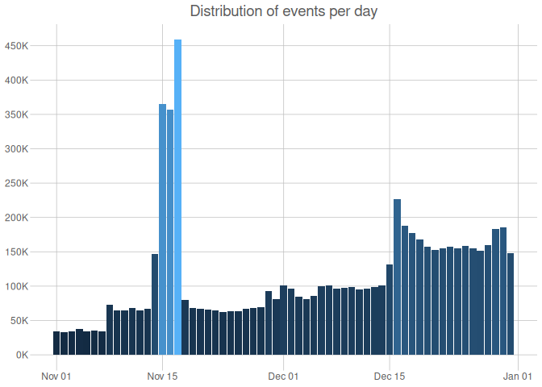

# Online Odyssey Outlet - Data Modelling Script
Lebintiti Kobe

- [Load Libraries](#load-libraries)
- [Load Data](#load-data)
  - [Clean up character data](#clean-up-character-data)
  - [Convert date column into their correct
    format](#convert-date-column-into-their-correct-format)
  - [Validate the data](#validate-the-data)
  - [User Columns](#user-columns)
  - [Events types](#events-types)
  - [Dates](#dates)
  - [Price](#price)
  - [Products](#products)
  - [Augment our data](#augment-our-data)
  - [Save the data](#save-the-data)

# Load Libraries

``` r
options(scipen = 999)
require(tidyverse)
require(here)
require(skimr)
require(ggthemes)
require(kableExtra)
require(arrow)

gc(verbose = F)
```

              used (Mb) gc trigger  (Mb) max used  (Mb)
    Ncells 1401933 74.9    2442704 130.5  2442704 130.5
    Vcells 2399394 18.4    8388608  64.0  5009633  38.3

# Load Data

``` r
nov_data <- read_csv(here("data/november.csv.gz"))
dec_data <- read_csv(here("data/december.csv.gz"))
```

Merge november and december data since the have the same data schema
then view the data

``` r
events_data <- bind_rows(nov_data, dec_data) %>%
  janitor::clean_names()

rm(nov_data)
rm(dec_data)
gc(verbose = F)
```

                used  (Mb) gc trigger   (Mb)  max used   (Mb)
    Ncells   7670390 409.7   13541424  723.2   9653861  515.6
    Vcells 107458787 819.9  190093002 1450.3 170943597 1304.2

``` r
events_data %>% head(n=50) %>% kable()
```

| event_time | event_type | product_id | category_id | category_code | brand | price | user_id | user_session |
|:---|:---|---:|---:|:---|:---|---:|---:|:---|
| 2019-11-01 00:00:14 UTC | cart | 1005014 | 2053013555631882496 | electronics.smartphone | samsung | 503.09 | 533326659 | 6b928be2-2bce-4640-8296-0efdf2fda22a |
| 2019-11-01 00:00:41 UTC | purchase | 13200605 | 2053013557192163840 | furniture.bedroom.bed | NA | 566.30 | 559368633 | d6034fa2-41fb-4ac0-9051-55ea9fc9147a |
| 2019-11-01 00:01:04 UTC | purchase | 1005161 | 2053013555631882496 | electronics.smartphone | xiaomi | 211.92 | 513351129 | e6b7ce9b-1938-4e20-976c-8b4163aea11d |
| 2019-11-01 00:03:24 UTC | cart | 1801881 | 2053013554415534336 | electronics.video.tv | samsung | 488.80 | 557746614 | 4d76d6d3-fff5-4880-8327-e9e57b618e0e |
| 2019-11-01 00:03:39 UTC | cart | 1005115 | 2053013555631882496 | electronics.smartphone | apple | 949.47 | 565865924 | fd4bd6d4-bd14-4fdc-9aff-bd41a594f82e |
| 2019-11-01 00:04:51 UTC | purchase | 1004856 | 2053013555631882496 | electronics.smartphone | samsung | 128.42 | 562958505 | 0f039697-fedc-40fa-8830-39c1a024351d |
| 2019-11-01 00:05:54 UTC | cart | 1002542 | 2053013555631882496 | electronics.smartphone | apple | 486.80 | 549256216 | dcbdc6e4-cd49-4ee8-95c5-e85f3c618fa1 |
| 2019-11-01 00:06:33 UTC | purchase | 1801881 | 2053013554415534336 | electronics.video.tv | samsung | 488.80 | 557746614 | 4d76d6d3-fff5-4880-8327-e9e57b618e0e |
| 2019-11-01 00:06:34 UTC | purchase | 5800823 | 2053013553945772544 | electronics.audio.subwoofer | nakamichi | 123.56 | 514166940 | 8ef5214a-86ad-4d0b-8df3-4280dd411b47 |
| 2019-11-01 00:06:38 UTC | cart | 1004856 | 2053013555631882496 | electronics.smartphone | samsung | 128.42 | 513645631 | 61ceaf50-820a-4858-9a68-bab804d47a22 |
| 2019-11-01 00:06:42 UTC | cart | 1004856 | 2053013555631882496 | electronics.smartphone | samsung | 128.42 | 513645631 | 61ceaf50-820a-4858-9a68-bab804d47a22 |
| 2019-11-01 00:07:22 UTC | cart | 1002542 | 2053013555631882496 | electronics.smartphone | apple | 486.80 | 549256216 | dcbdc6e4-cd49-4ee8-95c5-e85f3c618fa1 |
| 2019-11-01 00:07:38 UTC | purchase | 30000218 | 2127425436764865024 | construction.tools.welding | magnetta | 254.78 | 515240495 | 0253151d-5c84-4809-ba02-38ac405494e1 |
| 2019-11-01 00:08:44 UTC | cart | 1005124 | 2053013555631882496 | electronics.smartphone | apple | 1583.48 | 562210838 | a58d94c8-c0d4-4f24-bf3c-04c4e69ea153 |
| 2019-11-01 00:09:17 UTC | cart | 1004856 | 2053013555631882496 | electronics.smartphone | samsung | 128.42 | 513645631 | 61ceaf50-820a-4858-9a68-bab804d47a22 |
| 2019-11-01 00:09:23 UTC | cart | 1801881 | 2053013554415534336 | electronics.video.tv | samsung | 488.80 | 557746614 | 4d76d6d3-fff5-4880-8327-e9e57b618e0e |
| 2019-11-01 00:10:08 UTC | cart | 1004856 | 2053013555631882496 | electronics.smartphone | samsung | 128.42 | 513645631 | 61ceaf50-820a-4858-9a68-bab804d47a22 |
| 2019-11-01 00:10:12 UTC | purchase | 1801881 | 2053013554415534336 | electronics.video.tv | samsung | 488.80 | 557746614 | 4d76d6d3-fff5-4880-8327-e9e57b618e0e |
| 2019-11-01 00:10:38 UTC | purchase | 14300017 | 2053013557603205632 | electronics.audio.music_tools.piano | cortland | 84.94 | 538417163 | 3dae61c1-d018-44fd-b95a-b6b7659f11e3 |
| 2019-11-01 00:10:45 UTC | cart | 4804056 | 2053013554658804224 | electronics.audio.headphone | apple | 160.57 | 522355747 | 0a1f37d1-71b7-4645-a8a7-ab91bc198a51 |
| 2019-11-01 00:10:47 UTC | purchase | 1005124 | 2053013555631882496 | electronics.smartphone | apple | 1583.48 | 562210838 | a58d94c8-c0d4-4f24-bf3c-04c4e69ea153 |
| 2019-11-01 00:11:04 UTC | purchase | 1002524 | 2053013555631882496 | electronics.smartphone | apple | 531.26 | 549256216 | dcbdc6e4-cd49-4ee8-95c5-e85f3c618fa1 |
| 2019-11-01 00:11:06 UTC | cart | 1801881 | 2053013554415534336 | electronics.video.tv | samsung | 488.80 | 557746614 | 4d76d6d3-fff5-4880-8327-e9e57b618e0e |
| 2019-11-01 00:11:15 UTC | purchase | 1004856 | 2053013555631882496 | electronics.smartphone | samsung | 128.42 | 513645631 | 61ceaf50-820a-4858-9a68-bab804d47a22 |
| 2019-11-01 00:11:44 UTC | purchase | 1480557 | 2053013561092866816 | computers.desktop | netechnics | 772.19 | 555942729 | 2f64db5b-13d5-4895-8bc8-94bc50c51abc |
| 2019-11-01 00:11:48 UTC | cart | 1002532 | 2053013555631882496 | electronics.smartphone | apple | 532.57 | 566281998 | 21df43a6-be6a-44f6-b41c-c8fcbeb2e952 |
| 2019-11-01 00:12:13 UTC | purchase | 1801881 | 2053013554415534336 | electronics.video.tv | samsung | 488.80 | 557746614 | 4d76d6d3-fff5-4880-8327-e9e57b618e0e |
| 2019-11-01 00:12:16 UTC | cart | 1005129 | 2053013555631882496 | electronics.smartphone | apple | 1337.23 | 518267348 | 61f913b1-ed5f-4495-8139-7e3e20be92c3 |
| 2019-11-01 00:13:10 UTC | purchase | 1005129 | 2053013555631882496 | electronics.smartphone | apple | 1337.23 | 518267348 | 61f913b1-ed5f-4495-8139-7e3e20be92c3 |
| 2019-11-01 00:13:32 UTC | purchase | 1004767 | 2053013555631882496 | electronics.smartphone | samsung | 242.63 | 549987439 | 934b3598-e2de-46f7-9c1c-5d3a2bf4e83c |
| 2019-11-01 00:13:33 UTC | purchase | 1002532 | 2053013555631882496 | electronics.smartphone | apple | 532.57 | 566281998 | 21df43a6-be6a-44f6-b41c-c8fcbeb2e952 |
| 2019-11-01 00:13:40 UTC | cart | 1004873 | 2053013555631882496 | electronics.smartphone | samsung | 362.29 | 563558500 | e0729b6c-eafe-4b0f-9d66-6ee777d08488 |
| 2019-11-01 00:13:51 UTC | cart | 1801881 | 2053013554415534336 | electronics.video.tv | samsung | 488.80 | 557746614 | 4d76d6d3-fff5-4880-8327-e9e57b618e0e |
| 2019-11-01 00:14:09 UTC | cart | 1004856 | 2053013555631882496 | electronics.smartphone | samsung | 128.42 | 513645631 | 8cccf28f-136d-4941-9005-755bec0a44c9 |
| 2019-11-01 00:14:23 UTC | cart | 1004856 | 2053013555631882496 | electronics.smartphone | samsung | 128.42 | 557839915 | 40304779-5050-440d-8325-cab689f35584 |
| 2019-11-01 00:14:37 UTC | cart | 1801881 | 2053013554415534336 | electronics.video.tv | samsung | 488.80 | 516426931 | ef4867dd-b922-4d92-abec-9a75acb2b769 |
| 2019-11-01 00:14:48 UTC | purchase | 1801881 | 2053013554415534336 | electronics.video.tv | samsung | 488.80 | 557746614 | 4d76d6d3-fff5-4880-8327-e9e57b618e0e |
| 2019-11-01 00:14:55 UTC | cart | 1801881 | 2053013554415534336 | electronics.video.tv | samsung | 488.80 | 516426931 | ef4867dd-b922-4d92-abec-9a75acb2b769 |
| 2019-11-01 00:15:10 UTC | purchase | 1801881 | 2053013554415534336 | electronics.video.tv | samsung | 488.80 | 516426931 | ef4867dd-b922-4d92-abec-9a75acb2b769 |
| 2019-11-01 00:15:10 UTC | cart | 1005105 | 2053013555631882496 | electronics.smartphone | apple | 1348.61 | 518840496 | ef3daa59-4936-43e5-a530-32902f64b2f4 |
| 2019-11-01 00:15:23 UTC | cart | 1005115 | 2053013555631882496 | electronics.smartphone | apple | 949.47 | 561713177 | 821f797d-f9f4-4108-a44b-dbcba4e96251 |
| 2019-11-01 00:15:23 UTC | purchase | 1005105 | 2053013555631882496 | electronics.smartphone | apple | 1348.61 | 518840496 | ef3daa59-4936-43e5-a530-32902f64b2f4 |
| 2019-11-01 00:15:29 UTC | cart | 1801881 | 2053013554415534336 | electronics.video.tv | samsung | 488.80 | 557746614 | 4d76d6d3-fff5-4880-8327-e9e57b618e0e |
| 2019-11-01 00:15:46 UTC | cart | 1005116 | 2053013555631882496 | electronics.smartphone | apple | 1013.86 | 513852314 | 892943dc-aacd-44d8-94ef-b2bcbc0d6240 |
| 2019-11-01 00:15:56 UTC | cart | 1005116 | 2053013555631882496 | electronics.smartphone | apple | 1013.86 | 513852314 | 892943dc-aacd-44d8-94ef-b2bcbc0d6240 |
| 2019-11-01 00:16:06 UTC | purchase | 1801881 | 2053013554415534336 | electronics.video.tv | samsung | 488.80 | 557746614 | 4d76d6d3-fff5-4880-8327-e9e57b618e0e |
| 2019-11-01 00:17:29 UTC | cart | 1004873 | 2053013555631882496 | electronics.smartphone | samsung | 362.29 | 516676963 | 1083da5b-bead-49ea-8b5f-4f5eb3ff7cd2 |
| 2019-11-01 00:17:57 UTC | cart | 1801881 | 2053013554415534336 | electronics.video.tv | samsung | 488.80 | 557746614 | 4d76d6d3-fff5-4880-8327-e9e57b618e0e |
| 2019-11-01 00:18:28 UTC | purchase | 1801881 | 2053013554415534336 | electronics.video.tv | samsung | 488.80 | 557746614 | 4d76d6d3-fff5-4880-8327-e9e57b618e0e |
| 2019-11-01 00:18:39 UTC | cart | 1600282 | 2053013553056579840 | computers.peripherals.printer | hp | 38.35 | 566188490 | c78bd75f-e8c1-4056-b961-909440a2c812 |

## Clean up character data

- Convert them to the same casing
- Remove whitespaces

``` r
events_data <- events_data %>%
  mutate(across(where(is.character), ~ trimws(.) %>% str_to_lower())) %>%
  mutate(across(contains("id"), ~ as.character(.)))
```

## Convert date column into their correct format

- Convert date in character format to date format

``` r
events_data <- events_data %>%
  mutate(across(contains("time"), ~ as_datetime(.)))
```

## Validate the data

Validate the data to make sure it do not violate business logic :

### Online Stores Business logic :

User Columns :

- Each row of our data should have a session_id

Event types :

- Usually we should have more product impressions than cart actions ,
  more cart actions than checkouts and so forth .

Date Columns :

- Data should be available on all business days dates .
- Times of order should always be before delivery times / return times ,
  and so on .

Price Columns :

- Prices can be less than zero .
- Investigate prices that are too high or too low .

Products/Brands/Categories :

- Each product ID should be unique to each product .
- Each product ID should have one brand/category and so forth .

Of course , there is so much we can validate for online store data , but
for now we focus on concepts that can be found in the data we have ,
nothing more nothing less .

> [!NOTE]
>
> In this case if a product has multiple brands , category code and
> category ID , we assign the most common brand , category code and ID
> in order to not have multiple values for brand and category columns .
>
> A better way to do things here is to actually assign the most recent
> brand , category code and ID to products with multiple values in these
> columns . This makes sense in online store case , so store manager can
> know which other past values were assign to the most recent , hence
> use value in those columns .

## User Columns

``` r
events_data %>%
  select(contains("user")) %>%
  skim()
```

|                                                  |            |
|:-------------------------------------------------|:-----------|
| Name                                             | Piped data |
| Number of rows                                   | 7033125    |
| Number of columns                                | 2          |
| \_\_\_\_\_\_\_\_\_\_\_\_\_\_\_\_\_\_\_\_\_\_\_   |            |
| Column type frequency:                           |            |
| character                                        | 2          |
| \_\_\_\_\_\_\_\_\_\_\_\_\_\_\_\_\_\_\_\_\_\_\_\_ |            |
| Group variables                                  | None       |

Data summary

**Variable type: character**

| skim_variable | n_missing | complete_rate | min | max | empty | n_unique | whitespace |
|:--------------|----------:|--------------:|----:|----:|------:|---------:|-----------:|
| user_id       |         0 |             1 |   8 |   9 |     0 |  1333980 |          0 |
| user_session  |        27 |             1 |  36 |  36 |     0 |  3169946 |          0 |

- We have 27 events records without any user_id . Lets investing these

``` r
events_data %>%
  filter(is.na(user_session)) %>%
  select(event_type, user_id, price, user_session) %>%
  print(n = 50) %>%
  kable()
```

    # A tibble: 27 × 4
       event_type user_id    price user_session
       <chr>      <chr>      <dbl> <chr>       
     1 cart       568843390  566.  <NA>        
     2 cart       570411102   97.8 <NA>        
     3 cart       570878749  244.  <NA>        
     4 cart       573722572  360.  <NA>        
     5 cart       576301354  181.  <NA>        
     6 cart       576935861  335.  <NA>        
     7 cart       579123407 1001.  <NA>        
     8 cart       580714819  708.  <NA>        
     9 cart       519513506   10.2 <NA>        
    10 cart       584193732   63.1 <NA>        
    11 cart       585526753  231.  <NA>        
    12 cart       585953165   97.8 <NA>        
    13 cart       586879399  226.  <NA>        
    14 cart       574084617   38.4 <NA>        
    15 cart       587428481  111.  <NA>        
    16 cart       589172852 1335.  <NA>        
    17 cart       590035230  327.  <NA>        
    18 cart       591290578  103.  <NA>        
    19 cart       591580955  452.  <NA>        
    20 cart       535383117  128.  <NA>        
    21 cart       592696948   63.1 <NA>        
    22 cart       592718043   22.3 <NA>        
    23 cart       570391628  893.  <NA>        
    24 cart       541641713  463.  <NA>        
    25 cart       594002694  106.  <NA>        
    26 cart       532482951  274.  <NA>        
    27 cart       595269952  446.  <NA>        

| event_type | user_id   |   price | user_session |
|:-----------|:----------|--------:|:-------------|
| cart       | 568843390 |  566.27 | NA           |
| cart       | 570411102 |   97.81 | NA           |
| cart       | 570878749 |  243.51 | NA           |
| cart       | 573722572 |  360.09 | NA           |
| cart       | 576301354 |  181.47 | NA           |
| cart       | 576935861 |  334.58 | NA           |
| cart       | 579123407 | 1001.42 | NA           |
| cart       | 580714819 |  707.84 | NA           |
| cart       | 519513506 |   10.17 | NA           |
| cart       | 584193732 |   63.06 | NA           |
| cart       | 585526753 |  231.38 | NA           |
| cart       | 585953165 |   97.79 | NA           |
| cart       | 586879399 |  226.30 | NA           |
| cart       | 574084617 |   38.35 | NA           |
| cart       | 587428481 |  110.65 | NA           |
| cart       | 589172852 | 1334.65 | NA           |
| cart       | 590035230 |  326.88 | NA           |
| cart       | 591290578 |  102.68 | NA           |
| cart       | 591580955 |  452.17 | NA           |
| cart       | 535383117 |  128.32 | NA           |
| cart       | 592696948 |   63.06 | NA           |
| cart       | 592718043 |   22.33 | NA           |
| cart       | 570391628 |  892.94 | NA           |
| cart       | 541641713 |  463.31 | NA           |
| cart       | 594002694 |  106.03 | NA           |
| cart       | 532482951 |  273.74 | NA           |
| cart       | 595269952 |  445.98 | NA           |

- These are all Cart events . These should normally have session_ids ,
  but it is possible , maybe the user lost connection and when they got
  reconnected they were assigned a new session id

- For now we keep all these , in order to get true conversion of all out
  items

## Events types

``` r
events_data %>%
  janitor::tabyl(event_type) %>%
  kable()
```

| event_type |       n |   percent |
|:-----------|--------:|----------:|
| cart       | 5276372 | 0.7502173 |
| purchase   | 1756753 | 0.2497827 |

- 75% of all our events are cart events , which is to be expected in an
  online store system . People can add products to cart only to change
  their mind , or only to buy only those they can afford , mater fact
  not all items in cart usually get paid for .

## Dates

``` r
events_data %>%
  select(contains("time")) %>%
  skim()
```

|                                                  |            |
|:-------------------------------------------------|:-----------|
| Name                                             | Piped data |
| Number of rows                                   | 7033125    |
| Number of columns                                | 1          |
| \_\_\_\_\_\_\_\_\_\_\_\_\_\_\_\_\_\_\_\_\_\_\_   |            |
| Column type frequency:                           |            |
| POSIXct                                          | 1          |
| \_\_\_\_\_\_\_\_\_\_\_\_\_\_\_\_\_\_\_\_\_\_\_\_ |            |
| Group variables                                  | None       |

Data summary

**Variable type: POSIXct**

| skim_variable | n_missing | complete_rate | min | max | median | n_unique |
|:---|---:|---:|:---|:---|:---|---:|
| event_time | 0 | 1 | 2019-11-01 00:00:14 | 2019-12-31 23:59:09 | 2019-12-07 16:10:17 | 3033668 |

- Our dates range from 2019-11-01 to 2019-12-31 . Which reassures us
  that our data was merged correctly .

### Verify if each working day has a record

Unlike physical stores , online store can run even on non-working days .

- But if we had to find a list of all business days from one date to
  another , we use the {bizdays} and {timeDate} r package .
- bizdays::bizseq(from,to,“weekends”,holidays) , to find all business
  days besides weekends but this includes holidays .
- For holidays , we use timeDate::holidays(from , to , cal = “US”) .
- Then setdiff(bizdays_no_weekends,holidays) , to find all business days
  not in holidays .

``` r
events_data <- events_data %>%
  mutate(event_date = as_date(event_time))

events_data %>%
  group_by(event_date) %>%
  count() %>%
  filter(n < 1) %>% head(n=50) %>% kable()
```

| event_date |   n |
|:-----------|----:|

- No results got returned meaning there is no working date without a
  record / event , therefore we can be a little extra confident on our
  data

### Check the number of events distribution for each day of our event times

``` r
events_data %>%
  group_by(event_date) %>%
  summarise(n = n()) %>%
  ggplot(aes(x = event_date, y = n, fill = n)) +
  geom_col(show.legend = F) +
  labs(title = "Distribution of events per day", x = "Event Date", y = "") +
  scale_y_continuous(
    n.breaks = 10,
    labels = scales::label_number(scale = 0.001, suffix = "K")
  ) +
  theme_excel_new()
```



- Events are the lowest at the start of november , maybe be the time
  when the start-up launched (It actually the time the start up
  launched) .
- Events are the highest mid-november , maybe an event was held around
  this time .
- Then after we see a steady rise in events overtime , maybe correspond
  to normal business growth .

Enquire about these to figure out what was happening around these times
. Remember we need to adjust for any artificial boosting of events/sales
because these can bias products that were advertised as part of boosting
campaigns

## Price

``` r
events_data %>%
  select(price) %>%
  skim() 
```

|                                                  |            |
|:-------------------------------------------------|:-----------|
| Name                                             | Piped data |
| Number of rows                                   | 7033125    |
| Number of columns                                | 1          |
| \_\_\_\_\_\_\_\_\_\_\_\_\_\_\_\_\_\_\_\_\_\_\_   |            |
| Column type frequency:                           |            |
| numeric                                          | 1          |
| \_\_\_\_\_\_\_\_\_\_\_\_\_\_\_\_\_\_\_\_\_\_\_\_ |            |
| Group variables                                  | None       |

Data summary

**Variable type: numeric**

| skim_variable | n_missing | complete_rate | mean | sd | p0 | p25 | p50 | p75 | p100 | hist |
|:---|---:|---:|---:|---:|---:|---:|---:|---:|---:|:---|
| price | 0 | 1 | 318.68 | 343.81 | 0 | 104.25 | 189.18 | 385.83 | 2574.07 | ▇▂▁▁▁ |

- We have a price range of \\0 - \\2600 and most products are prices
  below \$600 . More than 75% of the prices are below \$400

### Investigate low price products

``` r
events_data %>%
  distinct(product_id, .keep_all = T) %>%
  filter(price <= 0) %>%
  distinct(product_id, .keep_all = T)
```

    # A tibble: 1,365 × 10
       event_time          event_type product_id category_id     category_code brand
       <dttm>              <chr>      <chr>      <chr>           <chr>         <chr>
     1 2019-11-08 05:55:09 cart       5800296    20530135539457… electronics.… <NA> 
     2 2019-11-08 06:36:20 cart       19200239   20530135562023… construction… <NA> 
     3 2019-11-08 08:54:07 cart       13500452   20530135570998… furniture.be… <NA> 
     4 2019-11-08 09:51:42 cart       5701421    20530135539709… auto.accesso… <NA> 
     5 2019-11-08 11:47:28 cart       28722404   20530135657820… apparel.shoes <NA> 
     6 2019-11-08 13:06:49 cart       1802136    20530135544155… electronics.… <NA> 
     7 2019-11-08 17:01:14 cart       1005283    20530135556318… electronics.… <NA> 
     8 2019-11-08 17:07:48 cart       28722414   20530135656394… apparel.shoes <NA> 
     9 2019-11-08 17:12:31 cart       17200939   20530135597926… furniture.li… <NA> 
    10 2019-11-08 17:37:17 cart       50600107   21349050448336… auto.accesso… <NA> 
    # ℹ 1,355 more rows
    # ℹ 4 more variables: price <dbl>, user_id <chr>, user_session <chr>,
    #   event_date <date>

``` r
zero_price_ids <- events_data %>%
  distinct(product_id, .keep_all = T) %>%
  filter(price <= 0) %>%
  distinct(product_id, .keep_all = T) %>%
  pull(product_id)

events_data %>%
  filter(product_id %in% zero_price_ids) %>%
  arrange(product_id) %>%
  group_by(product_id) %>%
  summarise(
    n_event_type = length(list(unique(event_type))),
    n_brands = length(list(unique(brand)))
  ) %>%
  filter(n_brands > 1 | n_event_type > 1) %>% 
  head(n=50) %>% kable()
```

| product_id | n_event_type | n_brands |
|:-----------|-------------:|---------:|

- We have around 1400 products with prices of zero , all of them do not
  have brands codes and they dont have any purchase event . These may
  products that we dropped from the catalog by some brand which was not
  selling well .
- Here we can drop the products since it wont be possible to calculate
  metrics like Revenue , Conversion , e.t.c

``` r
events_data <- events_data %>%
  filter(!product_id %in% zero_price_ids)

rm(zero_price_ids)
gc(verbose = F)
```

                used  (Mb) gc trigger   (Mb)  max used   (Mb)
    Ncells   6364387 339.9   13541424  723.2  10831171  578.5
    Vcells 104803073 799.6  234472600 1788.9 234472600 1788.9

### Investigate high priced products

``` r
events_data %>%
  select(-contains("event"), -contains("user")) %>%
  filter(price > 2000) %>%
  janitor::tabyl(category_code) %>%
  arrange(desc(percent)) %>% head(n=50) %>% kable()
```

| category_code                       |    n |   percent |
|:------------------------------------|-----:|----------:|
| electronics.smartphone              | 2334 | 0.2336570 |
| construction.tools.light            | 1903 | 0.1905096 |
| computers.notebook                  | 1378 | 0.1379517 |
| electronics.video.tv                |  881 | 0.0881970 |
| appliances.personal.massager        |  608 | 0.0608670 |
| electronics.audio.headphone         |  446 | 0.0446491 |
| computers.desktop                   |  428 | 0.0428471 |
| electronics.clocks                  |  363 | 0.0363400 |
| furniture.bedroom.blanket           |  301 | 0.0301331 |
| appliances.kitchen.refrigerators    |  266 | 0.0266293 |
| computers.peripherals.printer       |  161 | 0.0161177 |
| appliances.sewing_machine           |  128 | 0.0128141 |
| apparel.underwear                   |   60 | 0.0060066 |
| electronics.camera.photo            |   58 | 0.0058064 |
| sport.bicycle                       |   53 | 0.0053058 |
| electronics.audio.microphone        |   46 | 0.0046051 |
| furniture.living_room.sofa          |   45 | 0.0045050 |
| appliances.kitchen.washer           |   43 | 0.0043047 |
| sport.trainer                       |   38 | 0.0038042 |
| computers.components.cooler         |   35 | 0.0035039 |
| apparel.shoes.moccasins             |   32 | 0.0032035 |
| electronics.audio.acoustic          |   29 | 0.0029032 |
| kids.skates                         |   28 | 0.0028031 |
| appliances.kitchen.coffee_machine   |   27 | 0.0027030 |
| construction.tools.drill            |   23 | 0.0023025 |
| auto.accessories.compressor         |   21 | 0.0021023 |
| sport.tennis                        |   21 | 0.0021023 |
| apparel.shirt                       |   19 | 0.0019021 |
| apparel.shorts                      |   19 | 0.0019021 |
| appliances.iron                     |   19 | 0.0019021 |
| furniture.bathroom.bath             |   16 | 0.0016018 |
| apparel.shoes.keds                  |   15 | 0.0015017 |
| electronics.audio.music_tools.piano |   15 | 0.0015017 |
| appliances.kitchen.toster           |   13 | 0.0013014 |
| computers.components.motherboard    |    9 | 0.0009010 |
| construction.components.faucet      |    9 | 0.0009010 |
| apparel.sock                        |    8 | 0.0008009 |
| construction.tools.saw              |    8 | 0.0008009 |
| construction.tools.screw            |    8 | 0.0008009 |
| kids.toys                           |    8 | 0.0008009 |
| electronics.camera.video            |    7 | 0.0007008 |
| apparel.costume                     |    6 | 0.0006007 |
| apparel.jumper                      |    6 | 0.0006007 |
| kids.carriage                       |    5 | 0.0005006 |
| sport.ski                           |    5 | 0.0005006 |
| computers.components.videocards     |    4 | 0.0004004 |
| appliances.kitchen.mixer            |    3 | 0.0003003 |
| construction.tools.generator        |    3 | 0.0003003 |
| electronics.telephone               |    3 | 0.0003003 |
| furniture.bedroom.bed               |    3 | 0.0003003 |

- Looking at top categories of high priced items by number of events ,
  the categories listed here are usually high prices , there is nothing
  too suspicious here .

## Products

Check if each product_id is associated with one brand and category

``` r
dup_data <- events_data %>%
  group_by(product_id) %>%
  summarise(
    n_brands = n_distinct(brand),
    n_cat_id = n_distinct(category_id),
    n_cat_code = n_distinct(category_code)
  )

dup_ids <- dup_data %>%
  filter(n_brands > 1 | n_cat_id > 1 | n_cat_code > 1) %>%
  pull(product_id)

events_data %>%
  filter(product_id %in% dup_ids) %>%
  arrange(product_id) %>%
  distinct(product_id, category_code, category_id, brand, .keep_all = T) %>% head(n=50) %>% kable()
```

| event_time | event_type | product_id | category_id | category_code | brand | price | user_id | user_session | event_date |
|:---|:---|:---|:---|:---|:---|---:|:---|:---|:---|
| 2019-11-17 11:03:35 | cart | 100000153 | 2053013565782098944 | apparel.shoes | respect | 71.82 | 539560712 | 392cb39f-729a-424f-b7fe-88e972a62dc6 | 2019-11-17 |
| 2019-12-03 17:14:57 | cart | 100000153 | 2232732098706276864 | apparel.shoes | respect | 71.82 | 512418569 | beaad469-b0cd-47e4-b4ad-af5d5ab48835 | 2019-12-03 |
| 2019-11-14 18:01:29 | cart | 100000154 | 2053013565782098944 | apparel.shoes | respect | 71.82 | 557737305 | 3513d358-de4e-46b2-a44e-9092894376a4 | 2019-11-14 |
| 2019-12-04 13:50:49 | cart | 100000154 | 2053013556521075200 | apparel.shoes | respect | 71.82 | 542972764 | 8b6f9eca-b33e-59e4-4861-83ffd423dbe8 | 2019-12-04 |
| 2019-11-14 20:04:11 | cart | 100000179 | 2053013560623104512 | auto.accessories.parktronic | parkmaster | 82.37 | 517921230 | e84132b5-f3a5-4a9a-bb8e-4513be2e4d31 | 2019-11-14 |
| 2019-12-22 19:02:56 | cart | 100000179 | 2232732109494026752 | accessories.umbrella | parkmaster | 82.37 | 519269501 | c0b9abfc-ed96-458d-849b-ad60e3b0bdcf | 2019-12-22 |
| 2019-11-16 11:11:03 | cart | 100000196 | 2070005009382113792 | apparel.underwear | milavitsa | 24.27 | 512886305 | 05fd068d-69ec-4612-8eeb-e43689a71d80 | 2019-11-16 |
| 2019-12-22 17:19:22 | cart | 100000196 | 2053013555573162240 | electronics.telephone | milavitsa | 24.27 | 514263794 | ea6eabe0-2852-4ee8-80de-8e0b1cdc8e2f | 2019-12-22 |
| 2019-11-15 09:03:23 | cart | 100000208 | 2070005009382113792 | apparel.underwear | milavitsa | 24.27 | 523225210 | b3211b30-16e5-462d-bb92-e051d85be814 | 2019-11-15 |
| 2019-12-22 16:17:00 | cart | 100000208 | 2053013555573162240 | electronics.telephone | milavitsa | 24.27 | 562854026 | fa184dad-c3ee-42b8-80ce-06093fa58ea0 | 2019-12-22 |
| 2019-11-16 04:42:47 | cart | 100000210 | 2053013553970938368 | auto.accessories.player | jvc | 334.63 | 523111321 | e5d23772-f186-4958-a416-2b83c1cd0491 | 2019-11-16 |
| 2019-12-02 13:43:37 | cart | 100000210 | 2053013554415534336 | electronics.video.tv | jvc | 334.63 | 531518245 | e8334f60-aa6f-4fc7-b3ef-ab48ca6459b0 | 2019-12-02 |
| 2019-11-14 06:25:28 | cart | 100000244 | 2053013553945772544 | electronics.audio.subwoofer | graffitisound | 69.50 | 571197745 | 3da5e918-72bc-4668-a954-70980e27cd60 | 2019-11-14 |
| 2019-12-01 19:10:34 | cart | 100000244 | 2232732082390433792 | electronics.audio.subwoofer | graffitisound | 69.50 | 513501781 | 3a4d07b2-f0de-4382-b214-48b7bb01f63e | 2019-12-01 |
| 2019-11-11 09:14:57 | cart | 100000263 | 2053013553945772544 | electronics.audio.subwoofer | jvc | 56.63 | 512590290 | aa9d8d1a-86c3-4fae-8819-51fa24da26a5 | 2019-11-11 |
| 2019-12-02 16:50:12 | cart | 100000263 | 2232732082390433792 | electronics.audio.subwoofer | jvc | 56.63 | 567712041 | 8587d635-dd39-f250-61bc-cfea557f4b41 | 2019-12-02 |
| 2019-11-16 05:58:14 | cart | 100000273 | 2053013560623104512 | auto.accessories.parktronic | parkmaster | 82.37 | 519856522 | 587c5a9e-0d32-4c88-9302-1e9500032152 | 2019-11-16 |
| 2019-12-29 21:13:39 | cart | 100000273 | 2232732109494026752 | accessories.umbrella | parkmaster | 82.37 | 514996695 | 26e43173-718e-42ef-a8ab-246c62379925 | 2019-12-29 |
| 2019-11-13 06:07:07 | cart | 100000324 | 2053013558945382912 | accessories.bag | continent | 14.65 | 514449103 | 96a852a2-6f9e-472d-811a-3a3273f9582c | 2019-11-13 |
| 2019-12-07 14:14:07 | cart | 100000324 | 2053013551907340544 | sport.ski | continent | 14.44 | 542020490 | 5282ad47-b9a7-4021-bfc4-300a8927fa7b | 2019-12-07 |
| 2019-11-21 13:24:44 | cart | 100000368 | 2053013552326770944 | appliances.environment.water_heater | delimano | 64.33 | 567545362 | 5cf21f7d-36c2-49d2-9a0b-cf16ae62eb7a | 2019-11-21 |
| 2019-12-20 14:15:07 | cart | 100000368 | 2053013557452210688 | electronics.clocks | delimano | 64.33 | 589880809 | 42bae229-5b15-4ed5-bdcb-f647a1e1a451 | 2019-12-20 |
| 2019-11-17 05:19:23 | cart | 100000783 | 2053013561780732928 | furniture.bedroom.pillow | adamas | 25.09 | 530125348 | 7824aef2-9006-4445-a266-37e807f752ee | 2019-11-17 |
| 2019-12-23 07:44:16 | cart | 100000783 | 2053013553375346944 | computers.notebook | adamas | 22.75 | 515792578 | 4a32f7e5-35db-4946-ad2b-c0bca5994f5b | 2019-12-23 |
| 2019-11-11 18:09:48 | cart | 100000811 | 2053013552293216256 | appliances.environment.air_heater | resanta | 63.77 | 512516193 | 4ac71402-4c69-4c8f-8657-2354dbc22557 | 2019-11-11 |
| 2019-12-28 14:56:14 | cart | 100000811 | 2232732091961835776 | appliances.environment.air_heater | resanta | 62.52 | 547562560 | 05ea8d40-4dfc-4dc1-a05d-a2ae613fa16c | 2019-12-28 |
| 2019-11-22 21:03:38 | cart | 100000912 | 2070005009382113792 | apparel.underwear | milavitsa | 30.12 | 515123982 | 8902290e-dbc1-4b28-a643-f451c600ffbd | 2019-11-22 |
| 2019-12-07 18:31:51 | cart | 100000912 | 2053013555573162240 | electronics.telephone | milavitsa | 30.12 | 571937025 | 6b158ea0-4beb-4d51-ac92-c0661a02e205 | 2019-12-07 |
| 2019-11-18 14:11:03 | cart | 100000923 | 2053013555262784000 | appliances.kitchen.blender | delimano | 64.33 | 527957518 | 3498a1a0-e77c-4e18-9239-9517f0493d90 | 2019-11-18 |
| 2019-12-05 09:59:02 | cart | 100000923 | 2232732091391410688 | appliances.kitchen.blender | delimano | 64.33 | 513048821 | db5244e7-dd2c-4736-ad58-baa53a11c085 | 2019-12-05 |
| 2019-11-13 15:13:29 | cart | 100001169 | 2053013561579406080 | electronics.clocks | skagen | 214.16 | 540302942 | 9ef72954-e867-4ac2-ab32-b588b874e70a | 2019-11-13 |
| 2019-12-06 09:53:31 | cart | 100001169 | 2232732082063278080 | electronics.clocks | skagen | 171.30 | 518937712 | 75e1fb4b-5640-42d4-83e5-c15a9128604d | 2019-12-06 |
| 2019-11-14 23:08:08 | cart | 100001222 | 2053013561579406080 | electronics.clocks | zeppelin | 460.76 | 554193341 | f169ed30-ee35-4674-9805-1c657d52c810 | 2019-11-14 |
| 2019-12-17 12:31:53 | cart | 100001222 | 2232732082063278080 | electronics.clocks | zeppelin | 460.76 | 564281366 | 3dd54f6a-cef6-48f9-a134-68954080ece7 | 2019-12-17 |
| 2019-11-13 10:37:16 | cart | 100001331 | 2053013561579406080 | electronics.clocks | armani | 270.79 | 515100484 | 2d183bc5-d31b-4689-901c-05f9717d8fcf | 2019-11-13 |
| 2019-12-13 15:18:09 | cart | 100001331 | 2232732082063278080 | electronics.clocks | armani | 216.74 | 521357386 | bb166218-3984-4b8e-89ba-b2ed042871ce | 2019-12-13 |
| 2019-11-17 15:11:16 | cart | 100001368 | 2053013561579406080 | electronics.clocks | michaelkors | 372.73 | 512432202 | 055831d0-5acf-4d76-8d4e-0fd147d49004 | 2019-11-17 |
| 2019-12-11 18:57:21 | cart | 100001368 | 2232732082063278080 | electronics.clocks | michaelkors | 298.21 | 518123270 | e988aa01-35ea-40c5-b57f-8e9e540c792d | 2019-12-11 |
| 2019-11-26 03:25:21 | cart | 100001372 | 2053013561579406080 | electronics.clocks | michaelkors | 350.07 | 535689276 | 759da3c4-a203-4bf4-89d3-4041b2d03bdc | 2019-11-26 |
| 2019-12-19 10:24:21 | cart | 100001372 | 2232732082063278080 | electronics.clocks | michaelkors | 280.06 | 522117746 | 57406bf0-d330-42be-98c9-efe3ef0d1c8e | 2019-12-19 |
| 2019-11-23 19:08:46 | cart | 100001428 | 2053013561780732928 | furniture.bedroom.pillow | dormeo | 43.73 | 520096881 | b52e4695-142c-4778-a517-a49a15236db1 | 2019-11-23 |
| 2019-12-26 15:38:28 | cart | 100001428 | 2053013553375346944 | computers.notebook | dormeo | 43.73 | 561413572 | 5ea92457-4590-4fd4-b608-e5e1c768623d | 2019-12-26 |
| 2019-11-16 16:16:05 | cart | 100001429 | 2053013561579406080 | electronics.clocks | dkny | 180.18 | 525482003 | c96830bf-f952-48ea-9307-1b9662471ef3 | 2019-11-16 |
| 2019-12-30 11:27:23 | cart | 100001429 | 2232732082063278080 | electronics.clocks | dkny | 144.15 | 578805552 | 558098ab-b567-4584-a3ed-c5559f7b4248 | 2019-12-30 |
| 2019-11-17 17:56:35 | cart | 100001505 | 2053013561579406080 | electronics.clocks | fossil | 134.88 | 513719479 | a50855d7-c0d2-4e1d-b732-7d5a89c6b070 | 2019-11-17 |
| 2019-12-24 09:32:23 | cart | 100001505 | 2232732082063278080 | electronics.clocks | fossil | 107.85 | 589145731 | 65d32af8-bd1f-477a-b6ab-24341f4d6200 | 2019-12-24 |
| 2019-11-14 13:59:33 | cart | 100001529 | 2053013552293216256 | appliances.environment.air_heater | rovus | 25.71 | 571482850 | 8c98bd3d-e05a-4fde-b768-ca189efe0077 | 2019-11-14 |
| 2019-12-08 05:24:11 | cart | 100001529 | 2232732091961835776 | appliances.environment.air_heater | rovus | 25.71 | 581881394 | 4ca22559-4a1c-4dd8-b1ce-643957006f2d | 2019-12-08 |
| 2019-11-14 05:19:44 | cart | 100001549 | 2086471240800797184 | apparel.trousers | puma | 44.51 | 518787892 | 286746fe-dbd3-4729-8954-ae466e117b26 | 2019-11-14 |
| 2019-12-02 14:52:35 | cart | 100001549 | 2053013558978937600 | sport.bicycle | puma | 44.51 | 515320895 | 3284fcb0-86c0-43e1-97c2-dba74a90dab8 | 2019-12-02 |

### If a product has two distinct brands / categories but one is NULL , replace NULL with the other brand / category

``` r
merge_data <- events_data %>%
  filter(product_id %in% dup_ids) %>%
  arrange(product_id) %>%
  distinct(product_id, brand, category_id, category_code) %>%
  group_by(product_id) %>%
  mutate(
    brands = list(brand),
    cat_ids = list(category_id),
    cat_codes = list(category_code)
  ) %>%
  rowwise() %>%
  mutate(
    brands = unique(brands) %>% na.omit() %>% list(),
    cat_ids = unique(brands) %>% na.omit() %>% list(),
    cat_codes = unique(cat_codes) %>% na.omit() %>% list(),
    brand_new = ifelse(
      length(brands) == 1 & length(brands[1]) > 0 & is.na(brand),
      brands[1],
      brand
    ),
    category_id_new = ifelse(
      length(cat_ids) == 1 & length(cat_ids[1]) > 0 & is.na(category_id),
      cat_ids[1],
      category_id
    ),
    category_code_new = ifelse(
      length(cat_codes) == 1 & length(cat_codes[1]) > 0 & is.na(category_code),
      cat_codes[1],
      category_code
    )
  ) %>%
  ungroup()

events_data <- left_join(events_data, merge_data) %>%
  mutate(
    brand = brand_new,
    category_id = category_id_new,
    category_code = category_code_new
  ) %>%
  select(-ends_with("new"), -brands, -cat_ids, -cat_codes)

events_data %>%
  filter(product_id %in% dup_ids) %>%
  arrange(product_id) %>%
  distinct(product_id, category_code, category_id, brand, .keep_all = T) %>% head(n=50) %>% kable()
```

| event_time | event_type | product_id | category_id | category_code | brand | price | user_id | user_session | event_date |
|:---|:---|:---|:---|:---|:---|---:|:---|:---|:---|
| 2019-11-17 11:03:35 | cart | 100000153 | 2053013565782098944 | apparel.shoes | respect | 71.82 | 539560712 | 392cb39f-729a-424f-b7fe-88e972a62dc6 | 2019-11-17 |
| 2019-12-03 17:14:57 | cart | 100000153 | 2232732098706276864 | apparel.shoes | respect | 71.82 | 512418569 | beaad469-b0cd-47e4-b4ad-af5d5ab48835 | 2019-12-03 |
| 2019-11-14 18:01:29 | cart | 100000154 | 2053013565782098944 | apparel.shoes | respect | 71.82 | 557737305 | 3513d358-de4e-46b2-a44e-9092894376a4 | 2019-11-14 |
| 2019-12-04 13:50:49 | cart | 100000154 | 2053013556521075200 | apparel.shoes | respect | 71.82 | 542972764 | 8b6f9eca-b33e-59e4-4861-83ffd423dbe8 | 2019-12-04 |
| 2019-11-14 20:04:11 | cart | 100000179 | 2053013560623104512 | auto.accessories.parktronic | parkmaster | 82.37 | 517921230 | e84132b5-f3a5-4a9a-bb8e-4513be2e4d31 | 2019-11-14 |
| 2019-12-22 19:02:56 | cart | 100000179 | 2232732109494026752 | accessories.umbrella | parkmaster | 82.37 | 519269501 | c0b9abfc-ed96-458d-849b-ad60e3b0bdcf | 2019-12-22 |
| 2019-11-16 11:11:03 | cart | 100000196 | 2070005009382113792 | apparel.underwear | milavitsa | 24.27 | 512886305 | 05fd068d-69ec-4612-8eeb-e43689a71d80 | 2019-11-16 |
| 2019-12-22 17:19:22 | cart | 100000196 | 2053013555573162240 | electronics.telephone | milavitsa | 24.27 | 514263794 | ea6eabe0-2852-4ee8-80de-8e0b1cdc8e2f | 2019-12-22 |
| 2019-11-15 09:03:23 | cart | 100000208 | 2070005009382113792 | apparel.underwear | milavitsa | 24.27 | 523225210 | b3211b30-16e5-462d-bb92-e051d85be814 | 2019-11-15 |
| 2019-12-22 16:17:00 | cart | 100000208 | 2053013555573162240 | electronics.telephone | milavitsa | 24.27 | 562854026 | fa184dad-c3ee-42b8-80ce-06093fa58ea0 | 2019-12-22 |
| 2019-11-16 04:42:47 | cart | 100000210 | 2053013553970938368 | auto.accessories.player | jvc | 334.63 | 523111321 | e5d23772-f186-4958-a416-2b83c1cd0491 | 2019-11-16 |
| 2019-12-02 13:43:37 | cart | 100000210 | 2053013554415534336 | electronics.video.tv | jvc | 334.63 | 531518245 | e8334f60-aa6f-4fc7-b3ef-ab48ca6459b0 | 2019-12-02 |
| 2019-11-14 06:25:28 | cart | 100000244 | 2053013553945772544 | electronics.audio.subwoofer | graffitisound | 69.50 | 571197745 | 3da5e918-72bc-4668-a954-70980e27cd60 | 2019-11-14 |
| 2019-12-01 19:10:34 | cart | 100000244 | 2232732082390433792 | electronics.audio.subwoofer | graffitisound | 69.50 | 513501781 | 3a4d07b2-f0de-4382-b214-48b7bb01f63e | 2019-12-01 |
| 2019-11-11 09:14:57 | cart | 100000263 | 2053013553945772544 | electronics.audio.subwoofer | jvc | 56.63 | 512590290 | aa9d8d1a-86c3-4fae-8819-51fa24da26a5 | 2019-11-11 |
| 2019-12-02 16:50:12 | cart | 100000263 | 2232732082390433792 | electronics.audio.subwoofer | jvc | 56.63 | 567712041 | 8587d635-dd39-f250-61bc-cfea557f4b41 | 2019-12-02 |
| 2019-11-16 05:58:14 | cart | 100000273 | 2053013560623104512 | auto.accessories.parktronic | parkmaster | 82.37 | 519856522 | 587c5a9e-0d32-4c88-9302-1e9500032152 | 2019-11-16 |
| 2019-12-29 21:13:39 | cart | 100000273 | 2232732109494026752 | accessories.umbrella | parkmaster | 82.37 | 514996695 | 26e43173-718e-42ef-a8ab-246c62379925 | 2019-12-29 |
| 2019-11-13 06:07:07 | cart | 100000324 | 2053013558945382912 | accessories.bag | continent | 14.65 | 514449103 | 96a852a2-6f9e-472d-811a-3a3273f9582c | 2019-11-13 |
| 2019-12-07 14:14:07 | cart | 100000324 | 2053013551907340544 | sport.ski | continent | 14.44 | 542020490 | 5282ad47-b9a7-4021-bfc4-300a8927fa7b | 2019-12-07 |
| 2019-11-21 13:24:44 | cart | 100000368 | 2053013552326770944 | appliances.environment.water_heater | delimano | 64.33 | 567545362 | 5cf21f7d-36c2-49d2-9a0b-cf16ae62eb7a | 2019-11-21 |
| 2019-12-20 14:15:07 | cart | 100000368 | 2053013557452210688 | electronics.clocks | delimano | 64.33 | 589880809 | 42bae229-5b15-4ed5-bdcb-f647a1e1a451 | 2019-12-20 |
| 2019-11-17 05:19:23 | cart | 100000783 | 2053013561780732928 | furniture.bedroom.pillow | adamas | 25.09 | 530125348 | 7824aef2-9006-4445-a266-37e807f752ee | 2019-11-17 |
| 2019-12-23 07:44:16 | cart | 100000783 | 2053013553375346944 | computers.notebook | adamas | 22.75 | 515792578 | 4a32f7e5-35db-4946-ad2b-c0bca5994f5b | 2019-12-23 |
| 2019-11-11 18:09:48 | cart | 100000811 | 2053013552293216256 | appliances.environment.air_heater | resanta | 63.77 | 512516193 | 4ac71402-4c69-4c8f-8657-2354dbc22557 | 2019-11-11 |
| 2019-12-28 14:56:14 | cart | 100000811 | 2232732091961835776 | appliances.environment.air_heater | resanta | 62.52 | 547562560 | 05ea8d40-4dfc-4dc1-a05d-a2ae613fa16c | 2019-12-28 |
| 2019-11-22 21:03:38 | cart | 100000912 | 2070005009382113792 | apparel.underwear | milavitsa | 30.12 | 515123982 | 8902290e-dbc1-4b28-a643-f451c600ffbd | 2019-11-22 |
| 2019-12-07 18:31:51 | cart | 100000912 | 2053013555573162240 | electronics.telephone | milavitsa | 30.12 | 571937025 | 6b158ea0-4beb-4d51-ac92-c0661a02e205 | 2019-12-07 |
| 2019-11-18 14:11:03 | cart | 100000923 | 2053013555262784000 | appliances.kitchen.blender | delimano | 64.33 | 527957518 | 3498a1a0-e77c-4e18-9239-9517f0493d90 | 2019-11-18 |
| 2019-12-05 09:59:02 | cart | 100000923 | 2232732091391410688 | appliances.kitchen.blender | delimano | 64.33 | 513048821 | db5244e7-dd2c-4736-ad58-baa53a11c085 | 2019-12-05 |
| 2019-11-13 15:13:29 | cart | 100001169 | 2053013561579406080 | electronics.clocks | skagen | 214.16 | 540302942 | 9ef72954-e867-4ac2-ab32-b588b874e70a | 2019-11-13 |
| 2019-12-06 09:53:31 | cart | 100001169 | 2232732082063278080 | electronics.clocks | skagen | 171.30 | 518937712 | 75e1fb4b-5640-42d4-83e5-c15a9128604d | 2019-12-06 |
| 2019-11-14 23:08:08 | cart | 100001222 | 2053013561579406080 | electronics.clocks | zeppelin | 460.76 | 554193341 | f169ed30-ee35-4674-9805-1c657d52c810 | 2019-11-14 |
| 2019-12-17 12:31:53 | cart | 100001222 | 2232732082063278080 | electronics.clocks | zeppelin | 460.76 | 564281366 | 3dd54f6a-cef6-48f9-a134-68954080ece7 | 2019-12-17 |
| 2019-11-13 10:37:16 | cart | 100001331 | 2053013561579406080 | electronics.clocks | armani | 270.79 | 515100484 | 2d183bc5-d31b-4689-901c-05f9717d8fcf | 2019-11-13 |
| 2019-12-13 15:18:09 | cart | 100001331 | 2232732082063278080 | electronics.clocks | armani | 216.74 | 521357386 | bb166218-3984-4b8e-89ba-b2ed042871ce | 2019-12-13 |
| 2019-11-17 15:11:16 | cart | 100001368 | 2053013561579406080 | electronics.clocks | michaelkors | 372.73 | 512432202 | 055831d0-5acf-4d76-8d4e-0fd147d49004 | 2019-11-17 |
| 2019-12-11 18:57:21 | cart | 100001368 | 2232732082063278080 | electronics.clocks | michaelkors | 298.21 | 518123270 | e988aa01-35ea-40c5-b57f-8e9e540c792d | 2019-12-11 |
| 2019-11-26 03:25:21 | cart | 100001372 | 2053013561579406080 | electronics.clocks | michaelkors | 350.07 | 535689276 | 759da3c4-a203-4bf4-89d3-4041b2d03bdc | 2019-11-26 |
| 2019-12-19 10:24:21 | cart | 100001372 | 2232732082063278080 | electronics.clocks | michaelkors | 280.06 | 522117746 | 57406bf0-d330-42be-98c9-efe3ef0d1c8e | 2019-12-19 |
| 2019-11-23 19:08:46 | cart | 100001428 | 2053013561780732928 | furniture.bedroom.pillow | dormeo | 43.73 | 520096881 | b52e4695-142c-4778-a517-a49a15236db1 | 2019-11-23 |
| 2019-12-26 15:38:28 | cart | 100001428 | 2053013553375346944 | computers.notebook | dormeo | 43.73 | 561413572 | 5ea92457-4590-4fd4-b608-e5e1c768623d | 2019-12-26 |
| 2019-11-16 16:16:05 | cart | 100001429 | 2053013561579406080 | electronics.clocks | dkny | 180.18 | 525482003 | c96830bf-f952-48ea-9307-1b9662471ef3 | 2019-11-16 |
| 2019-12-30 11:27:23 | cart | 100001429 | 2232732082063278080 | electronics.clocks | dkny | 144.15 | 578805552 | 558098ab-b567-4584-a3ed-c5559f7b4248 | 2019-12-30 |
| 2019-11-17 17:56:35 | cart | 100001505 | 2053013561579406080 | electronics.clocks | fossil | 134.88 | 513719479 | a50855d7-c0d2-4e1d-b732-7d5a89c6b070 | 2019-11-17 |
| 2019-12-24 09:32:23 | cart | 100001505 | 2232732082063278080 | electronics.clocks | fossil | 107.85 | 589145731 | 65d32af8-bd1f-477a-b6ab-24341f4d6200 | 2019-12-24 |
| 2019-11-14 13:59:33 | cart | 100001529 | 2053013552293216256 | appliances.environment.air_heater | rovus | 25.71 | 571482850 | 8c98bd3d-e05a-4fde-b768-ca189efe0077 | 2019-11-14 |
| 2019-12-08 05:24:11 | cart | 100001529 | 2232732091961835776 | appliances.environment.air_heater | rovus | 25.71 | 581881394 | 4ca22559-4a1c-4dd8-b1ce-643957006f2d | 2019-12-08 |
| 2019-11-14 05:19:44 | cart | 100001549 | 2086471240800797184 | apparel.trousers | puma | 44.51 | 518787892 | 286746fe-dbd3-4729-8954-ae466e117b26 | 2019-11-14 |
| 2019-12-02 14:52:35 | cart | 100001549 | 2053013558978937600 | sport.bicycle | puma | 44.51 | 515320895 | 3284fcb0-86c0-43e1-97c2-dba74a90dab8 | 2019-12-02 |

### Check Top Brands and Categories

``` r
events_data %>%
  janitor::tabyl(brand) %>%
  as_tibble() %>%
  arrange(desc(n)) %>%
  slice_head(n = 20) %>%
  kable(caption = "Top Brands")
```

| brand   |       n |   percent | valid_percent |
|:--------|--------:|----------:|--------------:|
| samsung | 1731844 | 0.2489306 |     0.3075536 |
| NA      | 1326103 | 0.1906105 |            NA |
| apple   | 1306775 | 0.1878323 |     0.2320667 |
| xiaomi  |  609927 | 0.0876693 |     0.1083153 |
| huawei  |  255420 | 0.0367134 |     0.0453594 |
| oppo    |  127180 | 0.0182805 |     0.0225856 |
| lg      |  113219 | 0.0162738 |     0.0201063 |
| artel   |   69756 | 0.0100265 |     0.0123878 |
| bosch   |   48179 | 0.0069251 |     0.0085560 |
| lenovo  |   46460 | 0.0066780 |     0.0082507 |
| indesit |   42358 | 0.0060884 |     0.0075222 |
| acer    |   38380 | 0.0055166 |     0.0068158 |
| haier   |   34015 | 0.0048892 |     0.0060406 |
| beko    |   32954 | 0.0047367 |     0.0058522 |
| midea   |   32432 | 0.0046617 |     0.0057595 |
| casio   |   28305 | 0.0040685 |     0.0050266 |
| hp      |   28276 | 0.0040643 |     0.0050215 |
| tefal   |   27065 | 0.0038903 |     0.0048064 |
| sony    |   27004 | 0.0038815 |     0.0047956 |
| vitek   |   26061 | 0.0037459 |     0.0046281 |

Top Brands

``` r
events_data %>%
  janitor::tabyl(category_code) %>%
  as_tibble() %>%
  arrange(desc(n)) %>%
  slice_head(n = 20) %>%
  kable(caption = "Top Category Codes")
```

| category_code                     |       n |   percent | valid_percent |
|:----------------------------------|--------:|----------:|--------------:|
| construction.tools.light          | 1791115 | 0.2574501 |     0.3087595 |
| electronics.smartphone            | 1490413 | 0.2142280 |     0.2569233 |
| NA                                | 1156131 | 0.1661792 |            NA |
| electronics.audio.headphone       |  222754 | 0.0320181 |     0.0383992 |
| sport.bicycle                     |  219328 | 0.0315256 |     0.0378086 |
| electronics.clocks                |  200052 | 0.0287549 |     0.0344858 |
| appliances.kitchen.refrigerators  |  177944 | 0.0255772 |     0.0306747 |
| appliances.personal.massager      |  167144 | 0.0240248 |     0.0288129 |
| appliances.kitchen.washer         |  165089 | 0.0237295 |     0.0284587 |
| appliances.environment.vacuum     |  155555 | 0.0223591 |     0.0268152 |
| electronics.video.tv              |  142194 | 0.0204386 |     0.0245120 |
| computers.notebook                |   62652 | 0.0090054 |     0.0108002 |
| apparel.shoes.slipons             |   43535 | 0.0062576 |     0.0075047 |
| apparel.shoes                     |   36241 | 0.0052092 |     0.0062474 |
| appliances.kitchen.blender        |   36112 | 0.0051906 |     0.0062251 |
| appliances.kitchen.oven           |   33536 | 0.0048204 |     0.0057811 |
| electronics.tablet                |   31743 | 0.0045627 |     0.0054720 |
| appliances.environment.air_heater |   29713 | 0.0042709 |     0.0051220 |
| furniture.bedroom.blanket         |   28883 | 0.0041516 |     0.0049790 |
| electronics.audio.subwoofer       |   27410 | 0.0039398 |     0.0047250 |

Top Category Codes

``` r
events_data %>%
  janitor::tabyl(category_id) %>%
  as_tibble() %>%
  arrange(desc(n)) %>%
  slice_head(n = 20) %>%
  kable(caption = "Top Category Ids") 
```

| category_id         |       n |   percent | valid_percent |
|:--------------------|--------:|----------:|--------------:|
| 2232732093077520640 | 1780665 | 0.2559480 |     0.3069581 |
| 2053013555631882496 | 1490390 | 0.2142247 |     0.2569193 |
| NA                  | 1156131 | 0.1661792 |            NA |
| 2053013554658804224 |  222754 | 0.0320181 |     0.0383992 |
| 2232732079706079232 |  217453 | 0.0312561 |     0.0374854 |
| 2232732099754852864 |  154057 | 0.0221437 |     0.0265570 |
| 2053013554415534336 |  141771 | 0.0203778 |     0.0244390 |
| 2053013563810776064 |   87950 | 0.0126417 |     0.0151612 |
| 2232732103101907456 |   79205 | 0.0113847 |     0.0136537 |
| 2232732092297380096 |   76076 | 0.0109350 |     0.0131143 |
| 2053013565983425536 |   75975 | 0.0109204 |     0.0130969 |
| 2232732101063475712 |   74056 | 0.0106446 |     0.0127661 |
| 2053013563835941888 |   73084 | 0.0105049 |     0.0125985 |
| 2053013553341792768 |   64209 | 0.0092292 |     0.0110686 |
| 2053013558920217344 |   58954 | 0.0084739 |     0.0101627 |
| 2053013563911439360 |   40830 | 0.0058688 |     0.0070384 |
| 2232732101407408640 |   37656 | 0.0054126 |     0.0064913 |
| 2232732091718566144 |   37535 | 0.0053952 |     0.0064704 |
| 2232732082063278080 |   25520 | 0.0036682 |     0.0043992 |
| 2172371436436455680 |   23799 | 0.0034208 |     0.0041026 |

Top Category Ids

For top brands , find their top categories

``` r
top_brands <- events_data %>%
  count(brand) %>%
  arrange(desc(n)) %>%
  select(brand)

brand_cat_data <- events_data %>%
  count(brand, category_code) %>%
  arrange(desc(n)) %>%
  left_join(x = top_brands) %>%
  group_by(brand) %>%
  left_join(x = top_brands)

events_data %>%
  count(brand, category_code) %>%
  arrange(desc(n)) %>%
  left_join(x = top_brands) %>%
  group_by(brand) %>%
  slice_max(order_by = n, n = 3) %>%
  left_join(x = top_brands) %>% head(n=50) %>% kable()
```

| brand   | category_code                       |       n |
|:--------|:------------------------------------|--------:|
| samsung | construction.tools.light            |  727041 |
| samsung | electronics.smartphone              |  619504 |
| samsung | appliances.personal.massager        |   60790 |
| NA      | NA                                  | 1156131 |
| NA      | appliances.kitchen.refrigerators    |   27699 |
| NA      | electronics.clocks                  |   11022 |
| apple   | construction.tools.light            |  521023 |
| apple   | electronics.smartphone              |  468818 |
| apple   | sport.bicycle                       |  116251 |
| xiaomi  | construction.tools.light            |  282132 |
| xiaomi  | electronics.smartphone              |  226867 |
| xiaomi  | sport.bicycle                       |   41652 |
| huawei  | construction.tools.light            |  147424 |
| huawei  | electronics.smartphone              |   87854 |
| huawei  | sport.bicycle                       |    4553 |
| oppo    | construction.tools.light            |   68326 |
| oppo    | electronics.smartphone              |   58714 |
| oppo    | appliances.kitchen.refrigerators    |     140 |
| lg      | appliances.kitchen.washer           |   37316 |
| lg      | appliances.personal.massager        |   24062 |
| lg      | electronics.video.tv                |   19190 |
| artel   | appliances.personal.massager        |   25513 |
| artel   | electronics.video.tv                |   23044 |
| artel   | appliances.kitchen.washer           |    8642 |
| bosch   | appliances.environment.vacuum       |   17210 |
| bosch   | construction.tools.drill            |    3502 |
| bosch   | appliances.kitchen.hood             |    2996 |
| lenovo  | electronics.audio.headphone         |   21170 |
| lenovo  | computers.notebook                  |   19618 |
| lenovo  | apparel.shoes.slipons               |    2181 |
| indesit | appliances.kitchen.refrigerators    |   21269 |
| indesit | appliances.kitchen.washer           |   20796 |
| indesit | appliances.kitchen.dishwasher       |     146 |
| acer    | computers.notebook                  |   19539 |
| acer    | electronics.audio.headphone         |   13989 |
| acer    | appliances.personal.massager        |    1296 |
| haier   | appliances.personal.massager        |   15175 |
| haier   | electronics.video.tv                |    9425 |
| haier   | appliances.kitchen.refrigerators    |    4430 |
| beko    | appliances.kitchen.washer           |   19143 |
| beko    | appliances.kitchen.refrigerators    |   10699 |
| beko    | appliances.kitchen.dishwasher       |    1163 |
| midea   | appliances.kitchen.washer           |   14927 |
| midea   | appliances.kitchen.refrigerators    |    5087 |
| midea   | furniture.bedroom.blanket           |    3952 |
| casio   | electronics.clocks                  |   27678 |
| casio   | apparel.underwear                   |     474 |
| casio   | electronics.audio.music_tools.piano |     153 |
| hp      | electronics.audio.headphone         |    9426 |
| hp      | computers.notebook                  |    8416 |

We see a pattern here , All brands with SMARTPHONE as their second best
category all have construction.tools.light as their top categories

We know Brands like Samsung , Apple , Huawei , e.t.c all specialize in
smartphone , so construction.tools.light is wrong . We should replace it
with smartphones . But we do this for brands that have smartphones as
their second best category .

``` r
events_data %>%
  count(brand, category_code) %>%
  arrange(desc(n)) %>%
  left_join(x = top_brands) %>%
  group_by(brand) %>%
  slice_max(order_by = n, n = 3) %>%
  left_join(x = top_brands) %>%
  group_by(brand) %>%
  mutate(cats = list(category_code)) %>%
  rowwise() %>%
  mutate(
    cats = na.omit(cats) %>% list(),
    category_code_new = ifelse(
      cats[1] == "construction.tools.light" &
        cats[2] == "electronics.smartphone" &
        category_code == "construction.tools.light" &
        length(cats) > 1,
      cats[2],
      category_code
    )
  ) %>%
  select(-n, -cats) %>% head(n=50) %>% kable()
```

| brand | category_code | category_code_new |
|:---|:---|:---|
| samsung | construction.tools.light | electronics.smartphone |
| samsung | electronics.smartphone | electronics.smartphone |
| samsung | appliances.personal.massager | appliances.personal.massager |
| NA | NA | NA |
| NA | appliances.kitchen.refrigerators | appliances.kitchen.refrigerators |
| NA | electronics.clocks | electronics.clocks |
| apple | construction.tools.light | electronics.smartphone |
| apple | electronics.smartphone | electronics.smartphone |
| apple | sport.bicycle | sport.bicycle |
| xiaomi | construction.tools.light | electronics.smartphone |
| xiaomi | electronics.smartphone | electronics.smartphone |
| xiaomi | sport.bicycle | sport.bicycle |
| huawei | construction.tools.light | electronics.smartphone |
| huawei | electronics.smartphone | electronics.smartphone |
| huawei | sport.bicycle | sport.bicycle |
| oppo | construction.tools.light | electronics.smartphone |
| oppo | electronics.smartphone | electronics.smartphone |
| oppo | appliances.kitchen.refrigerators | appliances.kitchen.refrigerators |
| lg | appliances.kitchen.washer | appliances.kitchen.washer |
| lg | appliances.personal.massager | appliances.personal.massager |
| lg | electronics.video.tv | electronics.video.tv |
| artel | appliances.personal.massager | appliances.personal.massager |
| artel | electronics.video.tv | electronics.video.tv |
| artel | appliances.kitchen.washer | appliances.kitchen.washer |
| bosch | appliances.environment.vacuum | appliances.environment.vacuum |
| bosch | construction.tools.drill | construction.tools.drill |
| bosch | appliances.kitchen.hood | appliances.kitchen.hood |
| lenovo | electronics.audio.headphone | electronics.audio.headphone |
| lenovo | computers.notebook | computers.notebook |
| lenovo | apparel.shoes.slipons | apparel.shoes.slipons |
| indesit | appliances.kitchen.refrigerators | appliances.kitchen.refrigerators |
| indesit | appliances.kitchen.washer | appliances.kitchen.washer |
| indesit | appliances.kitchen.dishwasher | appliances.kitchen.dishwasher |
| acer | computers.notebook | computers.notebook |
| acer | electronics.audio.headphone | electronics.audio.headphone |
| acer | appliances.personal.massager | appliances.personal.massager |
| haier | appliances.personal.massager | appliances.personal.massager |
| haier | electronics.video.tv | electronics.video.tv |
| haier | appliances.kitchen.refrigerators | appliances.kitchen.refrigerators |
| beko | appliances.kitchen.washer | appliances.kitchen.washer |
| beko | appliances.kitchen.refrigerators | appliances.kitchen.refrigerators |
| beko | appliances.kitchen.dishwasher | appliances.kitchen.dishwasher |
| midea | appliances.kitchen.washer | appliances.kitchen.washer |
| midea | appliances.kitchen.refrigerators | appliances.kitchen.refrigerators |
| midea | furniture.bedroom.blanket | furniture.bedroom.blanket |
| casio | electronics.clocks | electronics.clocks |
| casio | apparel.underwear | apparel.underwear |
| casio | electronics.audio.music_tools.piano | electronics.audio.music_tools.piano |
| hp | electronics.audio.headphone | electronics.audio.headphone |
| hp | computers.notebook | computers.notebook |

Here we see that our fix will work as intended .

``` r
brand_merge <- brand_cat_data %>%
  group_by(brand) %>%
  mutate(cats = list(category_code)) %>%
  rowwise() %>%
  mutate(
    cats = na.omit(cats) %>% list(),
    category_code_new = ifelse(
      cats[1] == "construction.tools.light" &
        cats[2] == "electronics.smartphone" &
        category_code == "construction.tools.light" &
        length(cats) > 1,
      cats[2],
      category_code
    )
  ) %>%
  select(-n, -cats)

events_data <- events_data %>%
  left_join(y = brand_merge)

rm(merge_data)
rm(dup_data)
rm(dup_ids)
```

``` r
length(events_data %>% pull(category_code) %>% na.omit())
```

    [1] 5801004

``` r
length(events_data %>% pull(category_code_new) %>% na.omit())
```

    [1] 5801004

Solutions seems to have worked just fine .

``` r
events_data <- events_data %>%
  mutate(category_code = category_code_new) %>%
  select(-ends_with("new"))
```

``` r
events_data %>%
  count(brand, category_code) %>%
  arrange(desc(n)) %>%
  left_join(x = top_brands) %>%
  na.omit() %>% head(n=50) %>% kable()
```

| brand   | category_code                          |       n |
|:--------|:---------------------------------------|--------:|
| samsung | electronics.smartphone                 | 1346545 |
| samsung | appliances.personal.massager           |   60790 |
| samsung | appliances.environment.vacuum          |   55993 |
| samsung | electronics.video.tv                   |   52846 |
| samsung | appliances.kitchen.washer              |   49766 |
| samsung | appliances.kitchen.refrigerators       |   49311 |
| samsung | electronics.clocks                     |   30688 |
| samsung | apparel.shoes.slipons                  |   21938 |
| samsung | sport.bicycle                          |   19269 |
| samsung | electronics.tablet                     |   14649 |
| samsung | electronics.audio.headphone            |   12679 |
| samsung | appliances.kitchen.microwave           |    5625 |
| samsung | furniture.bedroom.blanket              |    4225 |
| samsung | computers.peripherals.monitor          |    1948 |
| samsung | appliances.kitchen.oven                |     738 |
| samsung | appliances.kitchen.hob                 |     714 |
| samsung | appliances.kitchen.juicer              |     645 |
| samsung | computers.peripherals.printer          |     599 |
| samsung | computers.components.hdd               |     570 |
| samsung | appliances.kitchen.hood                |     450 |
| samsung | appliances.environment.air_conditioner |     440 |
| samsung | appliances.kitchen.dishwasher          |     381 |
| samsung | apparel.costume                        |     373 |
| samsung | kids.toys                              |     286 |
| samsung | electronics.audio.acoustic             |     175 |
| samsung | construction.tools.welding             |      68 |
| samsung | stationery.cartrige                    |      68 |
| samsung | electronics.camera.video               |      36 |
| samsung | appliances.iron                        |      13 |
| samsung | computers.components.memory            |      10 |
| samsung | computers.ebooks                       |       6 |
| apple   | electronics.smartphone                 |  989841 |
| apple   | sport.bicycle                          |  116251 |
| apple   | electronics.audio.headphone            |  106647 |
| apple   | electronics.clocks                     |   77742 |
| apple   | apparel.shoes.slipons                  |    6134 |
| apple   | computers.notebook                     |    4846 |
| apple   | electronics.tablet                     |    3635 |
| apple   | appliances.kitchen.refrigerators       |     689 |
| apple   | computers.desktop                      |     344 |
| apple   | computers.ebooks                       |     142 |
| apple   | furniture.kitchen.table                |     139 |
| apple   | computers.peripherals.mouse            |     111 |
| apple   | accessories.bag                        |      82 |
| apple   | apparel.scarf                          |      81 |
| apple   | computers.peripherals.keyboard         |      65 |
| apple   | apparel.sock                           |      17 |
| apple   | sport.ski                              |       9 |
| xiaomi  | electronics.smartphone                 |  508999 |
| xiaomi  | sport.bicycle                          |   41652 |

The category codes of top brand look fine , there are no suspicious
categories that need to be investigated .

``` r
events_data %>%
  count(brand, category_code, category_id) %>%
  arrange(desc(n)) %>%
  left_join(x = top_brands) %>%
  na.omit() %>% head(n=50) %>% kable()
```

| brand   | category_code                          | category_id         |      n |
|:--------|:---------------------------------------|:--------------------|-------:|
| samsung | electronics.smartphone                 | 2232732093077520640 | 727041 |
| samsung | electronics.smartphone                 | 2053013555631882496 | 619501 |
| samsung | appliances.personal.massager           | 2232732099754852864 |  58562 |
| samsung | electronics.video.tv                   | 2053013554415534336 |  52837 |
| samsung | appliances.kitchen.refrigerators       | 2053013563835941888 |  41110 |
| samsung | appliances.kitchen.washer              | 2053013563810776064 |  28691 |
| samsung | appliances.environment.vacuum          | 2053013565983425536 |  28000 |
| samsung | appliances.environment.vacuum          | 2232732101063475712 |  27993 |
| samsung | apparel.shoes.slipons                  | 2232732101407408640 |  21931 |
| samsung | appliances.kitchen.washer              | 2232732092297380096 |  21075 |
| samsung | sport.bicycle                          | 2232732079706079232 |  19269 |
| samsung | electronics.clocks                     | 2232732103101907456 |  17374 |
| samsung | electronics.tablet                     | 2172371436436455680 |  14649 |
| samsung | electronics.clocks                     | 2053013553341792768 |  13314 |
| samsung | electronics.audio.headphone            | 2053013554658804224 |  12679 |
| samsung | appliances.kitchen.microwave           | 2053013554776244480 |   5625 |
| samsung | appliances.kitchen.refrigerators       | 2053013563911439360 |   4565 |
| samsung | furniture.bedroom.blanket              | 2232732102103663104 |   4225 |
| samsung | appliances.kitchen.refrigerators       | 2232732091718566144 |   3636 |
| samsung | appliances.personal.massager           | 2232732099981345280 |   1976 |
| samsung | computers.peripherals.monitor          | 2053013553031414016 |   1948 |
| samsung | appliances.kitchen.juicer              | 2053013555220840960 |    645 |
| samsung | computers.components.hdd               | 2053013554222596608 |    570 |
| samsung | appliances.kitchen.hood                | 2053013563743667200 |    450 |
| samsung | appliances.kitchen.hob                 | 2053013563877884928 |    417 |
| samsung | computers.peripherals.printer          | 2053013552955916544 |    402 |
| samsung | appliances.kitchen.oven                | 2053013564003714048 |    396 |
| samsung | apparel.costume                        | 2232732109049430784 |    373 |
| samsung | appliances.kitchen.oven                | 2232732092565815808 |    342 |
| samsung | appliances.kitchen.hob                 | 2232732102749585920 |    297 |
| samsung | kids.toys                              | 2232732071460078336 |    286 |
| samsung | appliances.environment.air_conditioner | 2053013552351936512 |    260 |
| samsung | appliances.personal.massager           | 2232732100769874432 |    252 |
| samsung | appliances.kitchen.dishwasher          | 2053013557385101824 |    207 |
| samsung | appliances.environment.air_conditioner | 2053013557695480320 |    180 |
| samsung | electronics.audio.acoustic             | 2053013554499420416 |    175 |
| samsung | appliances.kitchen.dishwasher          | 2053013563944993536 |    174 |
| samsung | computers.peripherals.printer          | 2053013553056579840 |    147 |
| samsung | construction.tools.welding             | 2232732099436085760 |     68 |
| samsung | stationery.cartrige                    | 2053013552737812736 |     55 |
| samsung | computers.peripherals.printer          | 2232732086358245376 |     50 |
| samsung | electronics.camera.video               | 2053013554323259904 |     36 |
| samsung | appliances.iron                        | 2053013566176363520 |     13 |
| samsung | stationery.cartrige                    | 2232732107019387392 |     13 |
| samsung | computers.components.memory            | 2053013554189041920 |     10 |
| samsung | electronics.video.tv                   | 2053013552603594752 |      9 |
| samsung | apparel.shoes.slipons                  | 2053013552662315264 |      7 |
| samsung | computers.ebooks                       | 2053013553316626432 |      6 |
| samsung | electronics.smartphone                 | 2053013558525952512 |      3 |
| apple   | electronics.smartphone                 | 2232732093077520640 | 521023 |

Here , we see that there a unique brand and category combinations with
multiple category id .

Now that brands and categories are investigated , lets fix the issue
where same product has multiple categories and brands

- Lets assign top categories and brands to products products with
  multiple brand and categories , because ideally we should have one
  category and brand per product .

### Brands

Each product should be associated with one brand , category and category
ID

``` r
dup_data <- events_data %>%
  group_by(product_id) %>%
  summarise(
    n_brands = n_distinct(brand),
    n_cat_id = n_distinct(category_id),
    n_cat_code = n_distinct(category_code)
  )

dup_ids <- dup_data %>%
  filter(n_brands > 1 | n_cat_id > 1 | n_cat_code > 1) %>%
  pull(product_id)

events_data %>%
  filter(product_id %in% dup_ids) %>%
  arrange(product_id) %>%
  distinct(product_id, brand, category_code, category_id, .keep_all = T) %>%
  select(product_id, brand, category_code, category_id) %>% 
  head(n=20) %>% kable()
```

| product_id | brand         | category_code               | category_id         |
|:-----------|:--------------|:----------------------------|:--------------------|
| 100000153  | respect       | apparel.shoes               | 2053013565782098944 |
| 100000153  | respect       | apparel.shoes               | 2232732098706276864 |
| 100000154  | respect       | apparel.shoes               | 2053013565782098944 |
| 100000154  | respect       | apparel.shoes               | 2053013556521075200 |
| 100000179  | parkmaster    | auto.accessories.parktronic | 2053013560623104512 |
| 100000179  | parkmaster    | accessories.umbrella        | 2232732109494026752 |
| 100000196  | milavitsa     | apparel.underwear           | 2070005009382113792 |
| 100000196  | milavitsa     | electronics.telephone       | 2053013555573162240 |
| 100000208  | milavitsa     | apparel.underwear           | 2070005009382113792 |
| 100000208  | milavitsa     | electronics.telephone       | 2053013555573162240 |
| 100000210  | jvc           | auto.accessories.player     | 2053013553970938368 |
| 100000210  | jvc           | electronics.video.tv        | 2053013554415534336 |
| 100000244  | graffitisound | electronics.audio.subwoofer | 2053013553945772544 |
| 100000244  | graffitisound | electronics.audio.subwoofer | 2232732082390433792 |
| 100000263  | jvc           | electronics.audio.subwoofer | 2053013553945772544 |
| 100000263  | jvc           | electronics.audio.subwoofer | 2232732082390433792 |
| 100000273  | parkmaster    | auto.accessories.parktronic | 2053013560623104512 |
| 100000273  | parkmaster    | accessories.umbrella        | 2232732109494026752 |
| 100000324  | continent     | accessories.bag             | 2053013558945382912 |
| 100000324  | continent     | sport.ski                   | 2053013551907340544 |

Here we see that product ids have multiple brands , category code and
IDS , lets fix this by assigning the most common values to these product
IDs

``` r
merge <- events_data %>%
  count(product_id, brand, category_code, category_id) %>%
  arrange(desc(n)) %>%
  filter(!is.na(product_id)) %>%
  group_by(product_id) %>%
  slice_head(n = 1) %>%
  rename(
    "brand_new" = brand,
    "category_code_new" = category_code,
    "category_id_new" = category_id
  ) %>%
  arrange(desc(n))

events_data <- left_join(events_data, merge) %>%
  mutate(
    brand = brand_new,
    category_code = category_code_new,
    category_id = category_id_new
  ) %>%
  select(-ends_with("new"), -n)

events_data %>%
  filter(product_id %in% dup_ids) %>%
  arrange(product_id) %>%
  distinct(product_id, brand, category_code, category_id, .keep_all = T) %>%
  select(product_id, brand, category_code, category_id) %>%
  head(n=20) %>%
  kable()
```

| product_id | brand | category_code | category_id |
|:---|:---|:---|:---|
| 100000153 | respect | apparel.shoes | 2232732098706276864 |
| 100000154 | respect | apparel.shoes | 2053013565782098944 |
| 100000179 | parkmaster | auto.accessories.parktronic | 2053013560623104512 |
| 100000196 | milavitsa | apparel.underwear | 2070005009382113792 |
| 100000208 | milavitsa | apparel.underwear | 2070005009382113792 |
| 100000210 | jvc | electronics.video.tv | 2053013554415534336 |
| 100000244 | graffitisound | electronics.audio.subwoofer | 2232732082390433792 |
| 100000263 | jvc | electronics.audio.subwoofer | 2053013553945772544 |
| 100000273 | parkmaster | auto.accessories.parktronic | 2053013560623104512 |
| 100000324 | continent | sport.ski | 2053013551907340544 |
| 100000368 | delimano | electronics.clocks | 2053013557452210688 |
| 100000783 | adamas | computers.notebook | 2053013553375346944 |
| 100000811 | resanta | appliances.environment.air_heater | 2053013552293216256 |
| 100000912 | milavitsa | apparel.underwear | 2070005009382113792 |
| 100000923 | delimano | appliances.kitchen.blender | 2232732091391410688 |
| 100001169 | skagen | electronics.clocks | 2232732082063278080 |
| 100001222 | zeppelin | electronics.clocks | 2232732082063278080 |
| 100001331 | armani | electronics.clocks | 2232732082063278080 |
| 100001368 | michaelkors | electronics.clocks | 2053013561579406080 |
| 100001372 | michaelkors | electronics.clocks | 2232732082063278080 |

``` r
events_data %>%
  group_by(product_id) %>%
  summarise(
    n_brands = n_distinct(brand),
    n_cat_id = n_distinct(category_id),
    n_cat_code = n_distinct(category_code)
  ) %>%
  filter(n_brands > 1 | n_cat_id > 1 | n_cat_code > 1) %>%
  kable()
```

| product_id | n_brands | n_cat_id | n_cat_code |
|:-----------|---------:|---------:|-----------:|

Now we see that the product IDs now have one brand , category code and
id assigned to them .

### Category Code and ID

In online store databases , category code should be assigned to only one
category ID .

``` r
cat_data <- events_data %>%
  count(category_code, category_id) %>%
  arrange(category_code, desc(n))
cat_data %>% head(n=20) %>% kable()
```

| category_code        | category_id         |     n |
|:---------------------|:--------------------|------:|
| accessories.bag      | 2232732108453839616 |  3697 |
| accessories.bag      | 2053013558945382912 |  3089 |
| accessories.bag      | 2053013566209917952 |   965 |
| accessories.bag      | 2232732082935693312 |   937 |
| accessories.bag      | 2053013558668559104 |   774 |
| accessories.bag      | 2232732113503781888 |   755 |
| accessories.bag      | 2139150089359196160 |   320 |
| accessories.bag      | 2232732097330544896 |   291 |
| accessories.bag      | 2055156924407612160 |   263 |
| accessories.bag      | 2232732085997535232 |   148 |
| accessories.bag      | 2232732097255047680 |   116 |
| accessories.bag      | 2126679654801604864 |    74 |
| accessories.bag      | 2053013561420022272 |    61 |
| accessories.bag      | 2110937189033444096 |    59 |
| accessories.bag      | 2232732113596056320 |     4 |
| accessories.umbrella | 2232732109494026752 |   160 |
| accessories.umbrella | 2053013561185141504 |   112 |
| accessories.umbrella | 2094006249627582720 |    79 |
| accessories.wallet   | 2232732097397654016 | 10397 |
| accessories.wallet   | 2053013566243472384 |   636 |

``` r
merge <- cat_data %>%
  group_by(category_code) %>%
  slice_head(n = 1) %>%
  ungroup() %>%
  rename("category_id_new" = category_id)
merge %>% head(n=20) %>% kable()
```

| category_code              | category_id_new     |     n |
|:---------------------------|:--------------------|------:|
| accessories.bag            | 2232732108453839616 |  3697 |
| accessories.umbrella       | 2232732109494026752 |   160 |
| accessories.wallet         | 2232732097397654016 | 10397 |
| apparel.belt               | 2232732097473151488 |    22 |
| apparel.costume            | 2232732108923601664 |  3156 |
| apparel.dress              | 2146660887002349824 |   171 |
| apparel.glove              | 2159535995811266816 |    41 |
| apparel.jeans              | 2053013552469377280 |   321 |
| apparel.jumper             | 2166064855264526848 |   145 |
| apparel.scarf              | 2232732104343421440 |  7429 |
| apparel.shirt              | 2232732128041238784 |  3602 |
| apparel.shoes              | 2053013565639492608 |  4771 |
| apparel.shoes.ballet_shoes | 2232732103613612544 |  4597 |
| apparel.shoes.espadrilles  | 2232732098303623680 |  3634 |
| apparel.shoes.keds         | 2232732102019777024 | 14950 |
| apparel.shoes.moccasins    | 2053013557024391680 |  1397 |
| apparel.shoes.sandals      | 2232732098446230016 |   800 |
| apparel.shoes.slipons      | 2232732101407408640 | 46095 |
| apparel.shoes.step_ins     | 2232732103294845440 |  3025 |
| apparel.shorts             | 2232732107312988672 |   271 |

``` r
cat_data <- cat_data %>%
  left_join(y = merge %>% select(-n)) %>%
  select(-n)
cat_data %>% head(n=20) %>% kable()
```

| category_code        | category_id         | category_id_new     |
|:---------------------|:--------------------|:--------------------|
| accessories.bag      | 2232732108453839616 | 2232732108453839616 |
| accessories.bag      | 2053013558945382912 | 2232732108453839616 |
| accessories.bag      | 2053013566209917952 | 2232732108453839616 |
| accessories.bag      | 2232732082935693312 | 2232732108453839616 |
| accessories.bag      | 2053013558668559104 | 2232732108453839616 |
| accessories.bag      | 2232732113503781888 | 2232732108453839616 |
| accessories.bag      | 2139150089359196160 | 2232732108453839616 |
| accessories.bag      | 2232732097330544896 | 2232732108453839616 |
| accessories.bag      | 2055156924407612160 | 2232732108453839616 |
| accessories.bag      | 2232732085997535232 | 2232732108453839616 |
| accessories.bag      | 2232732097255047680 | 2232732108453839616 |
| accessories.bag      | 2126679654801604864 | 2232732108453839616 |
| accessories.bag      | 2053013561420022272 | 2232732108453839616 |
| accessories.bag      | 2110937189033444096 | 2232732108453839616 |
| accessories.bag      | 2232732113596056320 | 2232732108453839616 |
| accessories.umbrella | 2232732109494026752 | 2232732109494026752 |
| accessories.umbrella | 2053013561185141504 | 2232732109494026752 |
| accessories.umbrella | 2094006249627582720 | 2232732109494026752 |
| accessories.wallet   | 2232732097397654016 | 2232732097397654016 |
| accessories.wallet   | 2053013566243472384 | 2232732097397654016 |

Now each category_code has one ID assigned to it . Now lets merge this
with event data in order to fix category codes having multiple category
ids issue .

``` r
events_data %>%
  count(category_code, category_id) %>%
  arrange(category_code, desc(n)) %>% head(n=20) %>% kable()
```

| category_code        | category_id         |     n |
|:---------------------|:--------------------|------:|
| accessories.bag      | 2232732108453839616 |  3697 |
| accessories.bag      | 2053013558945382912 |  3089 |
| accessories.bag      | 2053013566209917952 |   965 |
| accessories.bag      | 2232732082935693312 |   937 |
| accessories.bag      | 2053013558668559104 |   774 |
| accessories.bag      | 2232732113503781888 |   755 |
| accessories.bag      | 2139150089359196160 |   320 |
| accessories.bag      | 2232732097330544896 |   291 |
| accessories.bag      | 2055156924407612160 |   263 |
| accessories.bag      | 2232732085997535232 |   148 |
| accessories.bag      | 2232732097255047680 |   116 |
| accessories.bag      | 2126679654801604864 |    74 |
| accessories.bag      | 2053013561420022272 |    61 |
| accessories.bag      | 2110937189033444096 |    59 |
| accessories.bag      | 2232732113596056320 |     4 |
| accessories.umbrella | 2232732109494026752 |   160 |
| accessories.umbrella | 2053013561185141504 |   112 |
| accessories.umbrella | 2094006249627582720 |    79 |
| accessories.wallet   | 2232732097397654016 | 10397 |
| accessories.wallet   | 2053013566243472384 |   636 |

``` r
events_data %>%
  left_join(y = cat_data) %>%
  count(category_code, category_id_new) %>%
  arrange(category_code, desc(n)) %>% head(n=20) %>% kable()
```

| category_code              | category_id_new     |     n |
|:---------------------------|:--------------------|------:|
| accessories.bag            | 2232732108453839616 | 11553 |
| accessories.umbrella       | 2232732109494026752 |   351 |
| accessories.wallet         | 2232732097397654016 | 11033 |
| apparel.belt               | 2232732097473151488 |    22 |
| apparel.costume            | 2232732108923601664 |  8091 |
| apparel.dress              | 2146660887002349824 |   171 |
| apparel.glove              | 2159535995811266816 |    73 |
| apparel.jeans              | 2053013552469377280 |   830 |
| apparel.jumper             | 2166064855264526848 |   145 |
| apparel.scarf              | 2232732104343421440 | 10931 |
| apparel.shirt              | 2232732128041238784 |  6981 |
| apparel.shoes              | 2053013565639492608 | 29966 |
| apparel.shoes.ballet_shoes | 2232732103613612544 |  4613 |
| apparel.shoes.espadrilles  | 2232732098303623680 |  3639 |
| apparel.shoes.keds         | 2232732102019777024 | 27485 |
| apparel.shoes.moccasins    | 2053013557024391680 |  2648 |
| apparel.shoes.sandals      | 2232732098446230016 |   955 |
| apparel.shoes.slipons      | 2232732101407408640 | 52509 |
| apparel.shoes.step_ins     | 2232732103294845440 |  3155 |
| apparel.shorts             | 2232732107312988672 |   276 |

Our proposed solution will work as intended

``` r
events_data <- events_data %>%
  left_join(y = cat_data)

events_data %>% select(category_id) %>% na.omit() %>% nrow()
```

    [1] 5801004

``` r
events_data %>% select(category_id_new) %>% na.omit() %>% nrow()
```

    [1] 5801004

``` r
rm(cat_data)
rm(merge)
rm(dup_data)
rm(dup_ids)
gc(verbose = F)
```

                used  (Mb) gc trigger   (Mb)  max used   (Mb)
    Ncells   6380825 340.8   13541424  723.2  13541424  723.2
    Vcells 111819742 853.2  337816544 2577.4 337816543 2577.4

``` r
events_data <- events_data %>%
  mutate(category_id = category_id_new) %>%
  select(-ends_with("new"))
events_data %>% head(n=20) %>% kable()
```

| event_time | event_type | product_id | category_id | category_code | brand | price | user_id | user_session | event_date |
|:---|:---|:---|:---|:---|:---|---:|:---|:---|:---|
| 2019-11-01 00:00:14 | cart | 1005014 | 2232732093077520640 | electronics.smartphone | samsung | 503.09 | 533326659 | 6b928be2-2bce-4640-8296-0efdf2fda22a | 2019-11-01 |
| 2019-11-01 00:00:41 | purchase | 13200605 | NA | NA | NA | 566.30 | 559368633 | d6034fa2-41fb-4ac0-9051-55ea9fc9147a | 2019-11-01 |
| 2019-11-01 00:01:04 | purchase | 1005161 | 2232732093077520640 | electronics.smartphone | xiaomi | 211.92 | 513351129 | e6b7ce9b-1938-4e20-976c-8b4163aea11d | 2019-11-01 |
| 2019-11-01 00:03:24 | cart | 1801881 | 2232732099754852864 | appliances.personal.massager | samsung | 488.80 | 557746614 | 4d76d6d3-fff5-4880-8327-e9e57b618e0e | 2019-11-01 |
| 2019-11-01 00:03:39 | cart | 1005115 | 2232732093077520640 | electronics.smartphone | apple | 949.47 | 565865924 | fd4bd6d4-bd14-4fdc-9aff-bd41a594f82e | 2019-11-01 |
| 2019-11-01 00:04:51 | purchase | 1004856 | 2232732093077520640 | electronics.smartphone | samsung | 128.42 | 562958505 | 0f039697-fedc-40fa-8830-39c1a024351d | 2019-11-01 |
| 2019-11-01 00:05:54 | cart | 1002542 | 2232732093077520640 | electronics.smartphone | apple | 486.80 | 549256216 | dcbdc6e4-cd49-4ee8-95c5-e85f3c618fa1 | 2019-11-01 |
| 2019-11-01 00:06:33 | purchase | 1801881 | 2232732099754852864 | appliances.personal.massager | samsung | 488.80 | 557746614 | 4d76d6d3-fff5-4880-8327-e9e57b618e0e | 2019-11-01 |
| 2019-11-01 00:06:34 | purchase | 5800823 | 2232732082390433792 | electronics.audio.subwoofer | nakamichi | 123.56 | 514166940 | 8ef5214a-86ad-4d0b-8df3-4280dd411b47 | 2019-11-01 |
| 2019-11-01 00:06:38 | cart | 1004856 | 2232732093077520640 | electronics.smartphone | samsung | 128.42 | 513645631 | 61ceaf50-820a-4858-9a68-bab804d47a22 | 2019-11-01 |
| 2019-11-01 00:06:42 | cart | 1004856 | 2232732093077520640 | electronics.smartphone | samsung | 128.42 | 513645631 | 61ceaf50-820a-4858-9a68-bab804d47a22 | 2019-11-01 |
| 2019-11-01 00:07:22 | cart | 1002542 | 2232732093077520640 | electronics.smartphone | apple | 486.80 | 549256216 | dcbdc6e4-cd49-4ee8-95c5-e85f3c618fa1 | 2019-11-01 |
| 2019-11-01 00:07:38 | purchase | 30000218 | 2232732095074009600 | construction.tools.welding | magnetta | 254.78 | 515240495 | 0253151d-5c84-4809-ba02-38ac405494e1 | 2019-11-01 |
| 2019-11-01 00:08:44 | cart | 1005124 | 2232732093077520640 | electronics.smartphone | apple | 1583.48 | 562210838 | a58d94c8-c0d4-4f24-bf3c-04c4e69ea153 | 2019-11-01 |
| 2019-11-01 00:09:17 | cart | 1004856 | 2232732093077520640 | electronics.smartphone | samsung | 128.42 | 513645631 | 61ceaf50-820a-4858-9a68-bab804d47a22 | 2019-11-01 |
| 2019-11-01 00:09:23 | cart | 1801881 | 2232732099754852864 | appliances.personal.massager | samsung | 488.80 | 557746614 | 4d76d6d3-fff5-4880-8327-e9e57b618e0e | 2019-11-01 |
| 2019-11-01 00:10:08 | cart | 1004856 | 2232732093077520640 | electronics.smartphone | samsung | 128.42 | 513645631 | 61ceaf50-820a-4858-9a68-bab804d47a22 | 2019-11-01 |
| 2019-11-01 00:10:12 | purchase | 1801881 | 2232732099754852864 | appliances.personal.massager | samsung | 488.80 | 557746614 | 4d76d6d3-fff5-4880-8327-e9e57b618e0e | 2019-11-01 |
| 2019-11-01 00:10:38 | purchase | 14300017 | NA | NA | NA | 84.94 | 538417163 | 3dae61c1-d018-44fd-b95a-b6b7659f11e3 | 2019-11-01 |
| 2019-11-01 00:10:45 | cart | 4804056 | 2232732079706079232 | sport.bicycle | apple | 160.57 | 522355747 | 0a1f37d1-71b7-4645-a8a7-ab91bc198a51 | 2019-11-01 |

Verify that each product has one brand , category code and ID .

``` r
events_data %>%
  group_by(product_id) %>%
  summarise(
    n_brands = n_distinct(brand),
    n_cat_id = n_distinct(category_id),
    n_cat_code = n_distinct(category_code)
  ) %>%
  filter(n_brands > 1 | n_cat_id > 1 | n_cat_code > 1) %>% 
  head(n=20) %>% kable()
```

| product_id | n_brands | n_cat_id | n_cat_code |
|:-----------|---------:|---------:|-----------:|

Now that is our basic data cleaning and data validation done .

## Augment our data

Here we derived extra information from existing columns which we may be
useful for us when doing actual analysis . Or we find data to add to
current data that we think will be helpful to us when doing our analysis
.

Ideas :

- Finding date , day of week , hour of day and Time without date of our
  event time column .  
- Category code values are written in such a way that we can break them
  down into multiple categories .

These info may be useful for us when doing the actual analyses , in this
case the second idea will definitely be useful for us .

### Event time

``` r
events_data <- events_data %>%
  mutate(
    event_hour = hour(event_time),
    event_day = wday(event_time, label = T, abbr = F),
    event_time_hms = format(event_time, "%H:%M:%S"),
    event_month = month(event_time , label = T , abbr = F)
  )

events_data %>% head(n=20) %>% kable()
```

| event_time | event_type | product_id | category_id | category_code | brand | price | user_id | user_session | event_date | event_hour | event_day | event_time_hms | event_month |
|:---|:---|:---|:---|:---|:---|---:|:---|:---|:---|---:|:---|:---|:---|
| 2019-11-01 00:00:14 | cart | 1005014 | 2232732093077520640 | electronics.smartphone | samsung | 503.09 | 533326659 | 6b928be2-2bce-4640-8296-0efdf2fda22a | 2019-11-01 | 0 | Friday | 00:00:14 | November |
| 2019-11-01 00:00:41 | purchase | 13200605 | NA | NA | NA | 566.30 | 559368633 | d6034fa2-41fb-4ac0-9051-55ea9fc9147a | 2019-11-01 | 0 | Friday | 00:00:41 | November |
| 2019-11-01 00:01:04 | purchase | 1005161 | 2232732093077520640 | electronics.smartphone | xiaomi | 211.92 | 513351129 | e6b7ce9b-1938-4e20-976c-8b4163aea11d | 2019-11-01 | 0 | Friday | 00:01:04 | November |
| 2019-11-01 00:03:24 | cart | 1801881 | 2232732099754852864 | appliances.personal.massager | samsung | 488.80 | 557746614 | 4d76d6d3-fff5-4880-8327-e9e57b618e0e | 2019-11-01 | 0 | Friday | 00:03:24 | November |
| 2019-11-01 00:03:39 | cart | 1005115 | 2232732093077520640 | electronics.smartphone | apple | 949.47 | 565865924 | fd4bd6d4-bd14-4fdc-9aff-bd41a594f82e | 2019-11-01 | 0 | Friday | 00:03:39 | November |
| 2019-11-01 00:04:51 | purchase | 1004856 | 2232732093077520640 | electronics.smartphone | samsung | 128.42 | 562958505 | 0f039697-fedc-40fa-8830-39c1a024351d | 2019-11-01 | 0 | Friday | 00:04:51 | November |
| 2019-11-01 00:05:54 | cart | 1002542 | 2232732093077520640 | electronics.smartphone | apple | 486.80 | 549256216 | dcbdc6e4-cd49-4ee8-95c5-e85f3c618fa1 | 2019-11-01 | 0 | Friday | 00:05:54 | November |
| 2019-11-01 00:06:33 | purchase | 1801881 | 2232732099754852864 | appliances.personal.massager | samsung | 488.80 | 557746614 | 4d76d6d3-fff5-4880-8327-e9e57b618e0e | 2019-11-01 | 0 | Friday | 00:06:33 | November |
| 2019-11-01 00:06:34 | purchase | 5800823 | 2232732082390433792 | electronics.audio.subwoofer | nakamichi | 123.56 | 514166940 | 8ef5214a-86ad-4d0b-8df3-4280dd411b47 | 2019-11-01 | 0 | Friday | 00:06:34 | November |
| 2019-11-01 00:06:38 | cart | 1004856 | 2232732093077520640 | electronics.smartphone | samsung | 128.42 | 513645631 | 61ceaf50-820a-4858-9a68-bab804d47a22 | 2019-11-01 | 0 | Friday | 00:06:38 | November |
| 2019-11-01 00:06:42 | cart | 1004856 | 2232732093077520640 | electronics.smartphone | samsung | 128.42 | 513645631 | 61ceaf50-820a-4858-9a68-bab804d47a22 | 2019-11-01 | 0 | Friday | 00:06:42 | November |
| 2019-11-01 00:07:22 | cart | 1002542 | 2232732093077520640 | electronics.smartphone | apple | 486.80 | 549256216 | dcbdc6e4-cd49-4ee8-95c5-e85f3c618fa1 | 2019-11-01 | 0 | Friday | 00:07:22 | November |
| 2019-11-01 00:07:38 | purchase | 30000218 | 2232732095074009600 | construction.tools.welding | magnetta | 254.78 | 515240495 | 0253151d-5c84-4809-ba02-38ac405494e1 | 2019-11-01 | 0 | Friday | 00:07:38 | November |
| 2019-11-01 00:08:44 | cart | 1005124 | 2232732093077520640 | electronics.smartphone | apple | 1583.48 | 562210838 | a58d94c8-c0d4-4f24-bf3c-04c4e69ea153 | 2019-11-01 | 0 | Friday | 00:08:44 | November |
| 2019-11-01 00:09:17 | cart | 1004856 | 2232732093077520640 | electronics.smartphone | samsung | 128.42 | 513645631 | 61ceaf50-820a-4858-9a68-bab804d47a22 | 2019-11-01 | 0 | Friday | 00:09:17 | November |
| 2019-11-01 00:09:23 | cart | 1801881 | 2232732099754852864 | appliances.personal.massager | samsung | 488.80 | 557746614 | 4d76d6d3-fff5-4880-8327-e9e57b618e0e | 2019-11-01 | 0 | Friday | 00:09:23 | November |
| 2019-11-01 00:10:08 | cart | 1004856 | 2232732093077520640 | electronics.smartphone | samsung | 128.42 | 513645631 | 61ceaf50-820a-4858-9a68-bab804d47a22 | 2019-11-01 | 0 | Friday | 00:10:08 | November |
| 2019-11-01 00:10:12 | purchase | 1801881 | 2232732099754852864 | appliances.personal.massager | samsung | 488.80 | 557746614 | 4d76d6d3-fff5-4880-8327-e9e57b618e0e | 2019-11-01 | 0 | Friday | 00:10:12 | November |
| 2019-11-01 00:10:38 | purchase | 14300017 | NA | NA | NA | 84.94 | 538417163 | 3dae61c1-d018-44fd-b95a-b6b7659f11e3 | 2019-11-01 | 0 | Friday | 00:10:38 | November |
| 2019-11-01 00:10:45 | cart | 4804056 | 2232732079706079232 | sport.bicycle | apple | 160.57 | 522355747 | 0a1f37d1-71b7-4645-a8a7-ab91bc198a51 | 2019-11-01 | 0 | Friday | 00:10:45 | November |

### Category Code

``` r
# events_data <- events_data %>%
#   rowwise() %>%
#   mutate(cat_splits = str_split(category_code, "\\.")) %>%
#   ungroup() %>%
#   mutate(length_split = length(cat_splits))
```

The above code is example of bad code . We applying str_split() to all
records in our data . Meaning it will be applied to all 7m+ records , we
will be computationally intensive .

The smart of way of doing things here is first extracting all unique
category codes , then applying str_split() to the subset then merging
the results back into the full dataset .

``` r
cat_code_data <- events_data %>% 
  distinct(category_code) %>%
  na.omit() %>%
  rowwise() %>%
  mutate(cat_split = str_split(category_code, "\\."),
  length_split = length(cat_split))
```

``` r
cat_code_data <- cat_code_data %>%
  ungroup() %>%
  separate(col = category_code , 
  into = paste0("cat_code_",1:max(cat_code_data$length_split)),
  sep = "\\.",
  remove = F) %>%
  select(-contains("split"))

cat_code_data %>% head(n=20) %>% kable()
```

| category_code | cat_code_1 | cat_code_2 | cat_code_3 | cat_code_4 |
|:---|:---|:---|:---|:---|
| electronics.smartphone | electronics | smartphone | NA | NA |
| appliances.personal.massager | appliances | personal | massager | NA |
| electronics.audio.subwoofer | electronics | audio | subwoofer | NA |
| construction.tools.welding | construction | tools | welding | NA |
| sport.bicycle | sport | bicycle | NA | NA |
| appliances.kitchen.refrigerators | appliances | kitchen | refrigerators | NA |
| computers.peripherals.printer | computers | peripherals | printer | NA |
| appliances.kitchen.microwave | appliances | kitchen | microwave | NA |
| computers.desktop | computers | desktop | NA | NA |
| construction.tools.generator | construction | tools | generator | NA |
| electronics.clocks | electronics | clocks | NA | NA |
| apparel.shoes.slipons | apparel | shoes | slipons | NA |
| appliances.kitchen.blender | appliances | kitchen | blender | NA |
| computers.notebook | computers | notebook | NA | NA |
| kids.skates | kids | skates | NA | NA |
| appliances.kitchen.hob | appliances | kitchen | hob | NA |
| appliances.environment.vacuum | appliances | environment | vacuum | NA |
| electronics.video.tv | electronics | video | tv | NA |
| appliances.sewing_machine | appliances | sewing_machine | NA | NA |
| appliances.environment.water_heater | appliances | environment | water_heater | NA |

Now we merge the above with our data .

``` r
events_data <- events_data %>%
  left_join(y=cat_code_data)

events_data %>% head(n=20) %>% kable()
```

| event_time | event_type | product_id | category_id | category_code | brand | price | user_id | user_session | event_date | event_hour | event_day | event_time_hms | event_month | cat_code_1 | cat_code_2 | cat_code_3 | cat_code_4 |
|:---|:---|:---|:---|:---|:---|---:|:---|:---|:---|---:|:---|:---|:---|:---|:---|:---|:---|
| 2019-11-01 00:00:14 | cart | 1005014 | 2232732093077520640 | electronics.smartphone | samsung | 503.09 | 533326659 | 6b928be2-2bce-4640-8296-0efdf2fda22a | 2019-11-01 | 0 | Friday | 00:00:14 | November | electronics | smartphone | NA | NA |
| 2019-11-01 00:00:41 | purchase | 13200605 | NA | NA | NA | 566.30 | 559368633 | d6034fa2-41fb-4ac0-9051-55ea9fc9147a | 2019-11-01 | 0 | Friday | 00:00:41 | November | NA | NA | NA | NA |
| 2019-11-01 00:01:04 | purchase | 1005161 | 2232732093077520640 | electronics.smartphone | xiaomi | 211.92 | 513351129 | e6b7ce9b-1938-4e20-976c-8b4163aea11d | 2019-11-01 | 0 | Friday | 00:01:04 | November | electronics | smartphone | NA | NA |
| 2019-11-01 00:03:24 | cart | 1801881 | 2232732099754852864 | appliances.personal.massager | samsung | 488.80 | 557746614 | 4d76d6d3-fff5-4880-8327-e9e57b618e0e | 2019-11-01 | 0 | Friday | 00:03:24 | November | appliances | personal | massager | NA |
| 2019-11-01 00:03:39 | cart | 1005115 | 2232732093077520640 | electronics.smartphone | apple | 949.47 | 565865924 | fd4bd6d4-bd14-4fdc-9aff-bd41a594f82e | 2019-11-01 | 0 | Friday | 00:03:39 | November | electronics | smartphone | NA | NA |
| 2019-11-01 00:04:51 | purchase | 1004856 | 2232732093077520640 | electronics.smartphone | samsung | 128.42 | 562958505 | 0f039697-fedc-40fa-8830-39c1a024351d | 2019-11-01 | 0 | Friday | 00:04:51 | November | electronics | smartphone | NA | NA |
| 2019-11-01 00:05:54 | cart | 1002542 | 2232732093077520640 | electronics.smartphone | apple | 486.80 | 549256216 | dcbdc6e4-cd49-4ee8-95c5-e85f3c618fa1 | 2019-11-01 | 0 | Friday | 00:05:54 | November | electronics | smartphone | NA | NA |
| 2019-11-01 00:06:33 | purchase | 1801881 | 2232732099754852864 | appliances.personal.massager | samsung | 488.80 | 557746614 | 4d76d6d3-fff5-4880-8327-e9e57b618e0e | 2019-11-01 | 0 | Friday | 00:06:33 | November | appliances | personal | massager | NA |
| 2019-11-01 00:06:34 | purchase | 5800823 | 2232732082390433792 | electronics.audio.subwoofer | nakamichi | 123.56 | 514166940 | 8ef5214a-86ad-4d0b-8df3-4280dd411b47 | 2019-11-01 | 0 | Friday | 00:06:34 | November | electronics | audio | subwoofer | NA |
| 2019-11-01 00:06:38 | cart | 1004856 | 2232732093077520640 | electronics.smartphone | samsung | 128.42 | 513645631 | 61ceaf50-820a-4858-9a68-bab804d47a22 | 2019-11-01 | 0 | Friday | 00:06:38 | November | electronics | smartphone | NA | NA |
| 2019-11-01 00:06:42 | cart | 1004856 | 2232732093077520640 | electronics.smartphone | samsung | 128.42 | 513645631 | 61ceaf50-820a-4858-9a68-bab804d47a22 | 2019-11-01 | 0 | Friday | 00:06:42 | November | electronics | smartphone | NA | NA |
| 2019-11-01 00:07:22 | cart | 1002542 | 2232732093077520640 | electronics.smartphone | apple | 486.80 | 549256216 | dcbdc6e4-cd49-4ee8-95c5-e85f3c618fa1 | 2019-11-01 | 0 | Friday | 00:07:22 | November | electronics | smartphone | NA | NA |
| 2019-11-01 00:07:38 | purchase | 30000218 | 2232732095074009600 | construction.tools.welding | magnetta | 254.78 | 515240495 | 0253151d-5c84-4809-ba02-38ac405494e1 | 2019-11-01 | 0 | Friday | 00:07:38 | November | construction | tools | welding | NA |
| 2019-11-01 00:08:44 | cart | 1005124 | 2232732093077520640 | electronics.smartphone | apple | 1583.48 | 562210838 | a58d94c8-c0d4-4f24-bf3c-04c4e69ea153 | 2019-11-01 | 0 | Friday | 00:08:44 | November | electronics | smartphone | NA | NA |
| 2019-11-01 00:09:17 | cart | 1004856 | 2232732093077520640 | electronics.smartphone | samsung | 128.42 | 513645631 | 61ceaf50-820a-4858-9a68-bab804d47a22 | 2019-11-01 | 0 | Friday | 00:09:17 | November | electronics | smartphone | NA | NA |
| 2019-11-01 00:09:23 | cart | 1801881 | 2232732099754852864 | appliances.personal.massager | samsung | 488.80 | 557746614 | 4d76d6d3-fff5-4880-8327-e9e57b618e0e | 2019-11-01 | 0 | Friday | 00:09:23 | November | appliances | personal | massager | NA |
| 2019-11-01 00:10:08 | cart | 1004856 | 2232732093077520640 | electronics.smartphone | samsung | 128.42 | 513645631 | 61ceaf50-820a-4858-9a68-bab804d47a22 | 2019-11-01 | 0 | Friday | 00:10:08 | November | electronics | smartphone | NA | NA |
| 2019-11-01 00:10:12 | purchase | 1801881 | 2232732099754852864 | appliances.personal.massager | samsung | 488.80 | 557746614 | 4d76d6d3-fff5-4880-8327-e9e57b618e0e | 2019-11-01 | 0 | Friday | 00:10:12 | November | appliances | personal | massager | NA |
| 2019-11-01 00:10:38 | purchase | 14300017 | NA | NA | NA | 84.94 | 538417163 | 3dae61c1-d018-44fd-b95a-b6b7659f11e3 | 2019-11-01 | 0 | Friday | 00:10:38 | November | NA | NA | NA | NA |
| 2019-11-01 00:10:45 | cart | 4804056 | 2232732079706079232 | sport.bicycle | apple | 160.57 | 522355747 | 0a1f37d1-71b7-4645-a8a7-ab91bc198a51 | 2019-11-01 | 0 | Friday | 00:10:45 | November | sport | bicycle | NA | NA |

``` r
rm(cat_code_data)
gc(verbose = F)
```

                used   (Mb) gc trigger   (Mb)  max used   (Mb)
    Ncells   6469701  345.6   13541424  723.2  13541424  723.2
    Vcells 150263976 1146.5  343172498 2618.2 343172498 2618.2

That is our basic data cleaning done .

## Save the data

For large datasets like this , it often not advised to save the data as
a .csv . There are other useful format designed for large data . Example
of this is the .parquet format . This format compresses the data , also
saves the data types of each column , so when we load the data again in
the future we dont start by converting data to correct formats first .

Popular r package for this format is {arrow} r package . It also allows
us to use tidyverse / dplyr syntax when we read in the data .

Use arrow::read_parquet() to read in our .parquet data . Use
arrow::write_parquet() to save the data in .parquet format .

``` r
# write_parquet(events_data , 
# "data/events_data_model.gz.parquet",
# compression = "gzip", 
# compression_level = 5)
```
